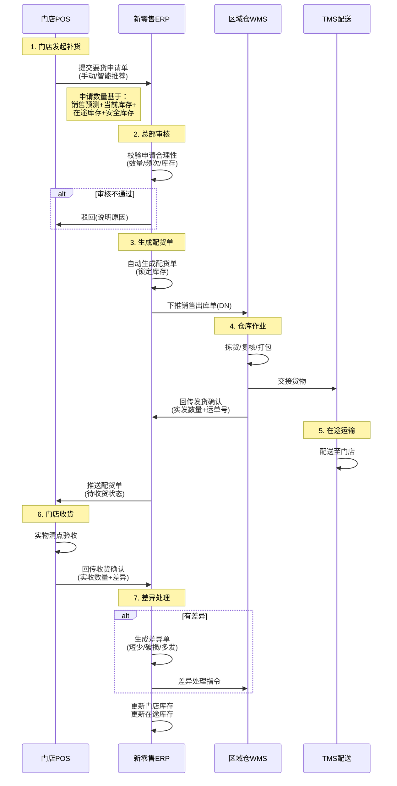
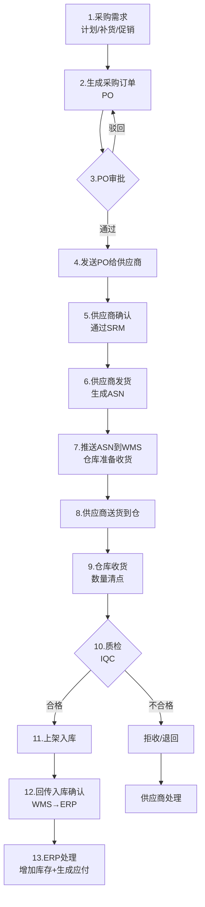
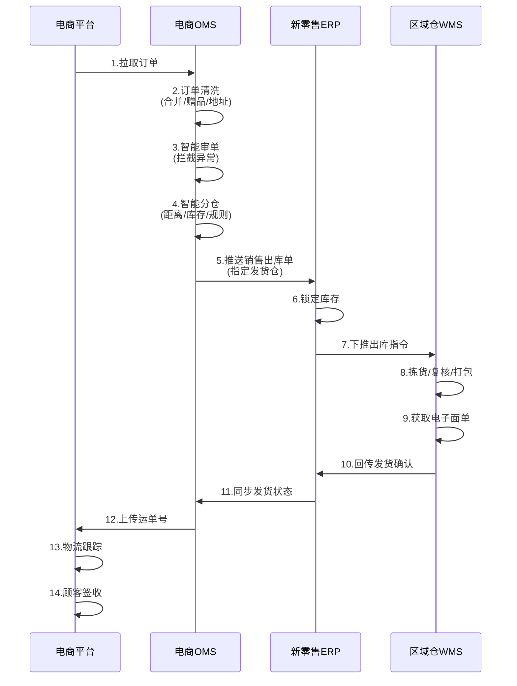
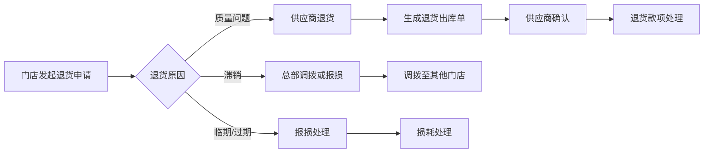
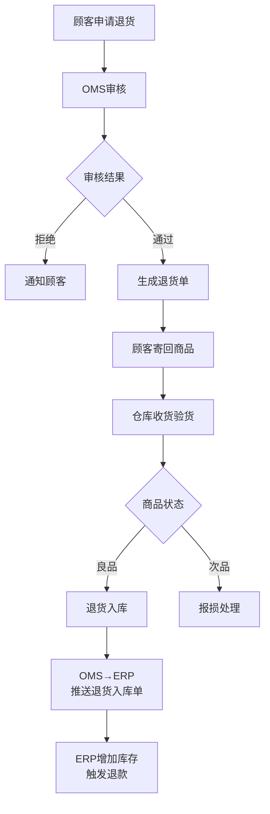
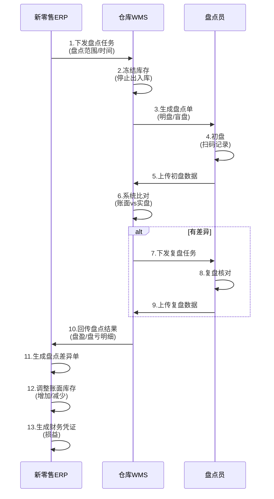

# 维他很忙 - 核心业务流程详解

> **文档类型**: 业务流程规范  
> **最后更新**: 2025-12-28  
> **适用范围**: ERP项目重构 - 业务流程参考

---

## 一、门店补货全流程（最高频场景）

### 1.1 流程概述
**业务背景**: 门店每周补货3-5次，保证畅销品不断货，控制滞销品库存。

**涉及角色**:
- 店长/理货员（门店）
- 采购计划员（总部）
- 仓管员（区域仓）
- 配送司机（物流）

### 1.2 详细流程



### 1.3 关键节点说明

#### 节点1: 门店要货申请
**操作人**: 店长

**数据输入**:
- 申请门店
- 申请SKU清单
- 申请数量
- 期望到货日期

**智能推荐逻辑**:
```
推荐补货量 = (日均销量 × 补货周期) + 安全库存 - 当前库存 - 在途库存
```

**校验规则**:
- 申请数量 > 0
- 单次申请SKU数量 ≤ 500
- 申请频次：每日最多1次
- 必须在补货周期内

#### 节点2: 总部审核
**操作人**: 采购计划员/系统自动

**审核规则**:
- 申请数量是否合理（不超过月均销量的2倍）
- 门店是否有未处理的历史欠款
- 申请SKU是否适合该门店（区域/类型匹配）
- 库存是否充足

**审核结果**:
- 通过：自动生成配货单
- 驳回：说明原因，门店可修改后重新提交
- 部分通过：删减部分SKU或数量

#### 节点3: 生成配货单
**系统操作**: ERP自动

**配货策略**:
- 优先配货：畅销品、临期品
- 批次选择：FEFO（先到期先出）
- 库存锁定：配货数量锁定，防止超卖

**生成单据**:
- 配货单（主单据）
- 销售出库单（推送WMS）
- 更新库存状态（可用→锁定）

#### 节点4: 仓库作业
**操作人**: 仓管员

**作业流程**:
1. 接收出库单（DN）
2. 系统推荐拣货路线
3. 扫码拣货（RF枪）
4. 复核（数量/批次/效期）
5. 打包贴标
6. 交接配送

**关键数据回传**:
- 实发数量（可能与计划不一致）
- 发货批次号
- 发货时间
- 运单号

#### 节点5: 配送
**操作人**: 配送司机

**配送要求**:
- 多温区分离（常温/冷藏/冷冻）
- 配送时效：24-48小时
- 破损控制：破损率<1%

#### 节点6: 门店收货
**操作人**: 店长/理货员

**收货操作**:
1. 核对运单与配货单
2. 清点数量
3. 检查质量（破损/效期）
4. 系统录入实收数量
5. 签收确认

**收货类型**:
- 正常收货：实收=实发
- 短少：实收<实发（需说明原因）
- 多收：实收>实发（异常，需上报）
- 拒收：质量问题全部拒收

#### 节点7: 差异处理
**差异类型**:

| 差异类型 | 处理方式 | 责任归属 |
|---------|---------|---------|
| 短少 | 生成短少单，仓库补发或门店索赔 | 仓库 |
| 破损 | 生成破损单，供应商索赔 | 供应商 |
| 多发 | 调整库存，门店退回或保留 | 仓库 |
| 效期不符 | 拒收，仓库重新发货 | 仓库 |

---

## 二、采购到入库全流程

### 2.1 流程概述
**业务背景**: 总部集中采购，供应商送货至区域仓。

**涉及角色**:
- 采购员（总部）
- 供应商（外部）
- 仓管员（区域仓）
- 质检员（仓库）
- 财务（总部）

### 2.2 详细流程



### 2.3 关键节点说明

#### 采购订单生成
**触发条件**:
- 库存低于补货点
- 促销活动备货
- 新店开业备货
- 门店要货汇总

**PO关键字段**:
- PO单号（系统生成）
- 供应商
- 商品SKU、采购数量、采购单价
- 交货仓库、期望到货日期
- 付款条件（账期/预付比例）

**审批规则**:
- 金额<10万：采购主管审批
- 金额≥10万：采购总监审批
- 金额≥50万：总经理审批

#### 质检环节
**质检项目**:
- 数量核对（±2%容差）
- 外观检查（包装完整性）
- 生产日期/批次号
- 保质期剩余天数（≥保质期的70%）
- 温度检查（冷链商品）

**质检结果**:
- 合格：全部入库
- 部分合格：合格品入库，不合格品拒收
- 不合格：全部拒收，生成退货单

---

## 三、电商订单履约流程

### 3.1 流程概述
**业务背景**: 多平台订单统一处理，智能分仓发货。

### 3.2 详细流程



### 3.3 智能分仓逻辑

**分仓规则**（优先级从高到低）:
1. 强制规则：指定仓库发货（VIP订单/特殊商品）
2. 库存规则：仓库有全部库存
3. 距离规则：就近发货（降低运费）
4. 时效规则：承诺时效（24小时达→前置仓）
5. 成本规则：综合运费最低

**拆单规则**:
- 不同仓库 → 拆分成多个子订单
- 常温+冷链 → 拆分（不同承运商）
- 大件+小件 → 拆分（不同包装）

---

## 四、退货处理流程

### 4.1 门店退货流程



**退货原因分类**:
- 质量问题：破损、变质、包装不合格
- 效期问题：临期、过期
- 滞销：销售不佳需清退
- 错发：收到错误商品

### 4.2 电商退货流程



---

## 五、盘点流程

### 5.1 盘点类型

| 盘点类型 | 触发时机 | 盘点范围 | 频率 |
|---------|---------|---------|------|
| 定期盘点 | 月末/季末/年末 | 全仓/全门店 | 月度/季度/年度 |
| 循环盘点 | 按计划 | ABC分类轮盘 | 每周 |
| 动碰盘点 | 发生出入库后 | 涉及SKU | 实时 |
| 临时盘点 | 异常触发 | 指定SKU/库位 | 按需 |

### 5.2 盘点流程



### 5.3 差异处理规则

**差异标准**:
- 金额差异<100元：自动调整
- 金额差异100-1000元：主管审批
- 金额差异>1000元：总监审批+原因分析

**盘盈处理**:
- 增加库存
- 借：库存商品 / 贷：待处理财产损溢

**盘亏处理**:
- 减少库存
- 借：待处理财产损溢 / 贷：库存商品
- 查明原因：盗窃/丢失/破损/系统错误

---

## 六、流程设计原则

### 6.1 单据流转原则
- **单据唯一性**：每个单据有唯一编号
- **单据追溯性**：单据间关联关系明确
- **单据不可篡改**：审核后不可修改，只能红冲

### 6.2 库存扣减原则
- **订单占用**：下单时锁定库存（预占）
- **出库扣减**：实际发货时扣减库存
- **退货增加**：退货入库时增加库存
- **盘点调整**：盘点差异调整库存

### 6.3 状态流转原则
- **正向流转**：草稿→审核→执行→完成
- **逆向流转**：驳回/取消/关闭
- **状态闭环**：任何状态都有出口

### 6.4 异常处理原则
- **预防为主**：前端校验，减少异常
- **异常留痕**：异常记录，可追溯
- **异常补偿**：定义补偿机制
- **人工介入**：复杂异常人工处理

---

## 七、流程优化方向

### 7.1 自动化优化
- 智能补货：AI预测需求，自动生成要货单
- 自动审批：小额订单自动审批
- 智能分仓：算法优化分仓策略

### 7.2 效率优化
- 批量操作：批量审核、批量发货
- 波次优化：合并订单拣货
- 路径优化：优化拣货路线

### 7.3 体验优化
- 进度可视：实时查看订单进度
- 异常预警：提前预警异常
- 移动化：支持手机端操作
