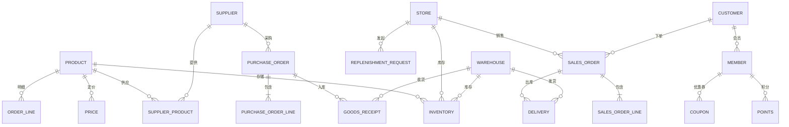
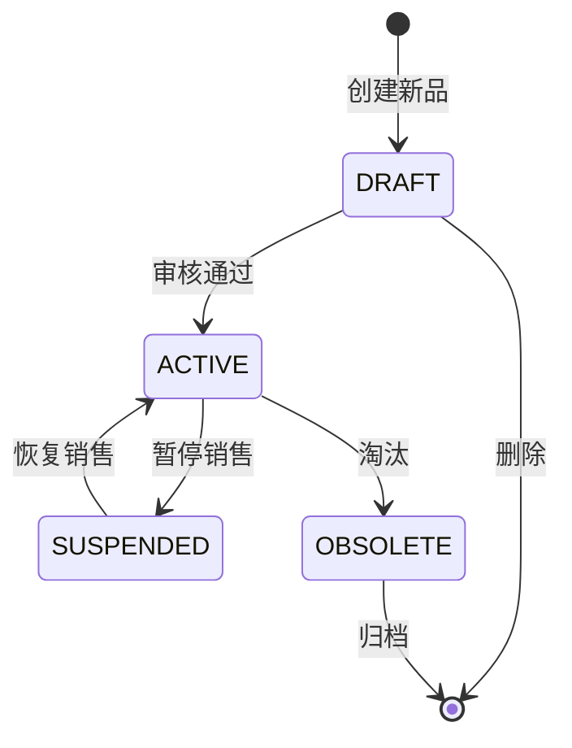

# 维他很忙 - 数据模型与业务对象

> **文档类型**: 数据规范  
> **最后更新**: 2025-12-28  
> **适用范围**: ERP项目重构 - 数据建模参考

---

## 一、核心业务对象关系图

### 1.1 整体ER图



---

## 二、核心业务对象定义

### 2.1 商品对象(Product)

#### 对象定义
商品是系统中最核心的主数据对象，一个SKU代表一个最小库存单位。

#### 核心字段清单

| 字段英文名 | 字段中文名 | 类型 | 必填 | 说明 |
|-----------|-----------|------|------|------|
| product_id | 商品ID | BIGINT | 是 | 主键，系统生成 |
| product_code | 商品编码 | VARCHAR(32) | 是 | 业务编码，唯一 |
| product_name | 商品名称 | VARCHAR(200) | 是 | 全称 |
| product_short_name | 商品简称 | VARCHAR(50) | 否 | 门店显示用 |
| barcode | 条码 | VARCHAR(20) | 是 | EAN-13/EAN-8 |
| category_id | 分类ID | BIGINT | 是 | 关联商品分类表 |
| brand_id | 品牌ID | BIGINT | 否 | 关联品牌表 |
| spec | 规格 | VARCHAR(100) | 否 | 如"500g"、"12罐/箱" |
| unit | 销售单位 | VARCHAR(10) | 是 | 如"瓶"、"袋"、"盒" |
| case_pack | 箱规 | INT | 是 | 一箱多少个销售单位 |
| shelf_life_days | 保质期天数 | INT | 是 | 如365天 |
| temperature_zone | 温区 | VARCHAR(10) | 是 | 枚举:NORMAL/COLD/FROZEN |
| is_batch_managed | 是否批次管理 | TINYINT | 是 | 0否/1是 |
| status | 状态 | VARCHAR(20) | 是 | 枚举:DRAFT/ACTIVE/SUSPENDED/OBSOLETE |
| created_at | 创建时间 | DATETIME | 是 | 系统时间 |
| updated_at | 更新时间 | DATETIME | 是 | 系统时间 |

#### 温区枚举值
- `NORMAL`: 常温(10-30℃)
- `COLD`: 冷藏(2-8℃)
- `FROZEN`: 冷冻(-18℃以下)

#### 状态流转


---

### 2.2 库存对象(Inventory)

#### 对象定义
库存是商品在特定组织（仓库/门店）的数量状态。

#### 核心字段清单

| 字段英文名 | 字段中文名 | 类型 | 必填 | 说明 |
|-----------|-----------|------|------|------|
| inventory_id | 库存ID | BIGINT | 是 | 主键 |
| product_id | 商品ID | BIGINT | 是 | 外键 |
| org_id | 组织ID | BIGINT | 是 | 仓库/门店ID |
| org_type | 组织类型 | VARCHAR(20) | 是 | 枚举:WAREHOUSE/STORE |
| batch_no | 批次号 | VARCHAR(50) | 否 | 批次管理商品必填 |
| production_date | 生产日期 | DATE | 否 | 批次管理商品必填 |
| expire_date | 到期日期 | DATE | 否 | 批次管理商品必填 |
| quantity_available | 可用数量 | DECIMAL(18,4) | 是 | 可销售/可用数量 |
| quantity_locked | 锁定数量 | DECIMAL(18,4) | 是 | 已下单未出库 |
| quantity_intransit | 在途数量 | DECIMAL(18,4) | 是 | 已发未到 |
| quantity_total | 账面总数量 | DECIMAL(18,4) | 是 | =可用+锁定 |
| cost_price | 成本单价 | DECIMAL(18,4) | 是 | 加权平均成本 |
| updated_at | 更新时间 | DATETIME | 是 | 库存变动时间 |

#### 库存数量关系
```
账面总数量 = 可用数量 + 锁定数量
实物数量 = 账面总数量 + 在途数量
```

#### 库存扣减规则
- **下单时**: quantity_available ↓, quantity_locked ↑
- **发货时**: quantity_locked ↓, quantity_total ↓
- **退货时**: quantity_available ↑
- **盘点时**: quantity_total调整为实盘数

---

### 2.3 订单对象(Order)

#### 2.3.1 采购订单(Purchase Order)

##### 订单头表(purchase_order)

| 字段英文名 | 字段中文名 | 类型 | 必填 | 说明 |
|-----------|-----------|------|------|------|
| po_id | 采购订单ID | BIGINT | 是 | 主键 |
| po_no | 采购订单号 | VARCHAR(32) | 是 | 业务单号，格式:PO+日期+序号 |
| supplier_id | 供应商ID | BIGINT | 是 | 外键 |
| warehouse_id | 收货仓库ID | BIGINT | 是 | 外键 |
| order_date | 订单日期 | DATE | 是 | 下单日期 |
| expected_delivery_date | 期望到货日期 | DATE | 是 | 要求供应商交货日期 |
| total_amount | 订单总金额 | DECIMAL(18,2) | 是 | 含税金额 |
| payment_term | 付款条件 | VARCHAR(50) | 是 | 如"货到付款"/"月结30天" |
| status | 订单状态 | VARCHAR(20) | 是 | 枚举:见下表 |
| created_by | 创建人 | BIGINT | 是 | 用户ID |
| approved_by | 审批人 | BIGINT | 否 | 用户ID |
| approved_at | 审批时间 | DATETIME | 否 | 审批通过时间 |

##### 采购订单状态

| 状态值 | 状态名称 | 说明 |
|--------|---------|------|
| DRAFT | 草稿 | 刚创建，未提交 |
| PENDING_APPROVAL | 待审批 | 已提交待审批 |
| APPROVED | 已审批 | 审批通过 |
| SENT_TO_SUPPLIER | 已发送供应商 | 已推送给供应商 |
| IN_RECEIVING | 收货中 | 部分收货 |
| RECEIVED | 已收货 | 全部收货完成 |
| CLOSED | 已关闭 | 手工关闭或完成 |
| CANCELLED | 已取消 | 取消采购 |

##### 订单行表(purchase_order_line)

| 字段英文名 | 字段中文名 | 类型 | 必填 | 说明 |
|-----------|-----------|------|------|------|
| line_id | 行ID | BIGINT | 是 | 主键 |
| po_id | 采购订单ID | BIGINT | 是 | 外键 |
| line_no | 行号 | INT | 是 | 从1开始 |
| product_id | 商品ID | BIGINT | 是 | 外键 |
| quantity_ordered | 订购数量 | DECIMAL(18,4) | 是 | 采购数量 |
| quantity_received | 已收货数量 | DECIMAL(18,4) | 是 | 累计收货数量 |
| unit_price | 采购单价 | DECIMAL(18,4) | 是 | 不含税单价 |
| tax_rate | 税率 | DECIMAL(5,2) | 是 | 如13% |
| line_amount | 行总金额 | DECIMAL(18,2) | 是 | =数量×单价×(1+税率) |
| status | 行状态 | VARCHAR(20) | 是 | OPEN/RECEIVING/CLOSED |

#### 2.3.2 销售订单(Sales Order)

##### 订单头表(sales_order)

| 字段英文名 | 字段中文名 | 类型 | 必填 | 说明 |
|-----------|-----------|------|------|------|
| so_id | 销售订单ID | BIGINT | 是 | 主键 |
| so_no | 销售订单号 | VARCHAR(32) | 是 | 业务单号，格式:SO+日期+序号 |
| order_source | 订单来源 | VARCHAR(20) | 是 | 枚举:STORE/ECOMMERCE/O2O/B2B |
| channel_order_no | 渠道订单号 | VARCHAR(50) | 否 | 如天猫订单号 |
| customer_id | 客户ID | BIGINT | 是 | 外键 |
| member_id | 会员ID | BIGINT | 否 | 外键，会员才有 |
| store_id | 门店ID | BIGINT | 否 | 门店订单必填 |
| warehouse_id | 发货仓库ID | BIGINT | 否 | 电商订单必填 |
| order_date | 订单日期 | DATETIME | 是 | 下单时间 |
| total_amount | 订单总金额 | DECIMAL(18,2) | 是 | 商品金额 |
| discount_amount | 优惠金额 | DECIMAL(18,2) | 是 | 促销/优惠券优惠 |
| payable_amount | 应付金额 | DECIMAL(18,2) | 是 | =总金额-优惠 |
| paid_amount | 实付金额 | DECIMAL(18,2) | 是 | 实际支付 |
| payment_method | 支付方式 | VARCHAR(20) | 是 | 枚举:WECHAT/ALIPAY/CASH/CARD |
| status | 订单状态 | VARCHAR(20) | 是 | 枚举:见下表 |

##### 销售订单状态

| 状态值 | 状态名称 | 可执行操作 |
|--------|---------|-----------|
| PENDING_PAYMENT | 待支付 | 支付/取消 |
| PAID | 已支付 | 发货/退款 |
| IN_PICKING | 拣货中 | - |
| SHIPPED | 已发货 | 确认收货 |
| DELIVERED | 已签收 | 退货/完成 |
| COMPLETED | 已完成 | - |
| CANCELLED | 已取消 | - |
| REFUNDED | 已退款 | - |

---

### 2.4 单据对象(Document)

#### 2.4.1 入库单(Goods Receipt)

| 字段英文名 | 字段中文名 | 类型 | 必填 | 说明 |
|-----------|-----------|------|------|------|
| gr_id | 入库单ID | BIGINT | 是 | 主键 |
| gr_no | 入库单号 | VARCHAR(32) | 是 | 格式:GR+日期+序号 |
| gr_type | 入库类型 | VARCHAR(20) | 是 | PURCHASE/RETURN/TRANSFER/ADJUST |
| source_doc_no | 源单号 | VARCHAR(32) | 否 | 如PO单号 |
| warehouse_id | 入库仓库 | BIGINT | 是 | 外键 |
| supplier_id | 供应商 | BIGINT | 否 | 采购入库必填 |
| receipt_date | 入库日期 | DATE | 是 | 实际收货日期 |
| status | 状态 | VARCHAR(20) | 是 | DRAFT/CONFIRMED/POSTED |

#### 2.4.2 出库单(Delivery)

| 字段英文名 | 字段中文名 | 类型 | 必填 | 说明 |
|-----------|-----------|------|------|------|
| delivery_id | 出库单ID | BIGINT | 是 | 主键 |
| delivery_no | 出库单号 | VARCHAR(32) | 是 | 格式:DO+日期+序号 |
| delivery_type | 出库类型 | VARCHAR(20) | 是 | SALES/TRANSFER/SCRAP |
| source_doc_no | 源单号 | VARCHAR(32) | 否 | 如SO单号 |
| warehouse_id | 出库仓库 | BIGINT | 是 | 外键 |
| destination_org_id | 目的地 | BIGINT | 否 | 门店/仓库ID |
| delivery_date | 出库日期 | DATE | 是 | 实际发货日期 |
| tracking_no | 运单号 | VARCHAR(50) | 否 | 物流运单号 |
| status | 状态 | VARCHAR(20) | 是 | DRAFT/CONFIRMED/SHIPPED/DELIVERED |

---

### 2.5 会员对象(Member)

#### 核心字段

| 字段英文名 | 字段中文名 | 类型 | 必填 | 说明 |
|-----------|-----------|------|------|------|
| member_id | 会员ID | BIGINT | 是 | 主键 |
| member_no | 会员卡号 | VARCHAR(20) | 是 | 唯一 |
| mobile | 手机号 | VARCHAR(11) | 是 | 唯一 |
| name | 姓名 | VARCHAR(50) | 否 | 可昵称 |
| gender | 性别 | CHAR(1) | 否 | M/F/U |
| birthday | 生日 | DATE | 否 | 用于生日营销 |
| member_level | 会员等级 | VARCHAR(20) | 是 | NORMAL/SILVER/GOLD/PLATINUM |
| growth_value | 成长值 | INT | 是 | 累计消费金额 |
| points_balance | 积分余额 | INT | 是 | 当前可用积分 |
| stored_value_balance | 储值余额 | DECIMAL(18,2) | 是 | 预存金额 |
| total_orders | 累计订单数 | INT | 是 | 统计 |
| total_amount | 累计消费金额 | DECIMAL(18,2) | 是 | 统计 |
| register_date | 注册日期 | DATE | 是 | 首次注册 |
| last_order_date | 最后消费日期 | DATE | 否 | RFM分析用 |
| status | 状态 | VARCHAR(20) | 是 | ACTIVE/INACTIVE/BLACKLIST |

#### 会员等级规则

| 等级 | 成长值范围 | 等级权益 |
|------|-----------|---------|
| NORMAL | 0-999 | 基础积分 |
| SILVER | 1000-4999 | 1.2倍积分+会员价 |
| GOLD | 5000-19999 | 1.5倍积分+会员价+生日券 |
| PLATINUM | 20000+ | 2倍积分+会员价+专属客服 |

---

## 三、字段命名规范

### 3.1 统一前缀

| 对象类型 | 表名前缀 | 字段前缀示例 |
|---------|---------|------------|
| 商品 | product_ | prod_ |
| 订单 | order_ | ord_ |
| 库存 | inventory_ | inv_ |
| 会员 | member_ | mem_ |
| 供应商 | supplier_ | sup_ |
| 仓库 | warehouse_ | wh_ |
| 门店 | store_ | store_ |

### 3.2 常用字段后缀

| 后缀 | 含义 | 示例 |
|------|------|------|
| _id | 主键ID | product_id |
| _no | 业务编号 | po_no, so_no |
| _code | 业务编码 | product_code |
| _name | 名称 | product_name |
| _date | 日期 | order_date |
| _at | 时间戳 | created_at, updated_at |
| _by | 操作人 | created_by, approved_by |
| _amount | 金额 | total_amount |
| _quantity | 数量 | quantity_ordered |
| _price | 单价 | unit_price |
| _rate | 比率 | tax_rate |
| _status | 状态 | status |

### 3.3 日期时间字段标准

| 字段名 | 类型 | 说明 |
|--------|------|------|
| created_at | DATETIME | 创建时间（系统时间） |
| updated_at | DATETIME | 最后更新时间（系统时间） |
| deleted_at | DATETIME | 软删除时间（软删除场景） |
| xxx_date | DATE | 业务日期（如order_date） |
| xxx_time | TIME | 业务时间（如delivery_time） |

### 3.4 状态字段标准

**字段名**: `status`  
**类型**: VARCHAR(20)  
**值格式**: 全大写下划线分隔，如`PENDING_APPROVAL`

---

## 四、枚举值标准定义

### 4.1 订单状态枚举

| 枚举类型 | 枚举值 | 说明 |
|---------|--------|------|
| 采购订单 | DRAFT | 草稿 |
|  | PENDING_APPROVAL | 待审批 |
|  | APPROVED | 已审批 |
|  | IN_RECEIVING | 收货中 |
|  | RECEIVED | 已收货 |
|  | CLOSED | 已关闭 |
|  | CANCELLED | 已取消 |
| 销售订单 | PENDING_PAYMENT | 待支付 |
|  | PAID | 已支付 |
|  | IN_PICKING | 拣货中 |
|  | SHIPPED | 已发货 |
|  | DELIVERED | 已签收 |
|  | COMPLETED | 已完成 |
|  | CANCELLED | 已取消 |

### 4.2 单据类型枚举

| 单据 | 类型枚举 | 说明 |
|------|---------|------|
| 入库单 | PURCHASE | 采购入库 |
|  | RETURN | 销售退货入库 |
|  | TRANSFER_IN | 调拨入库 |
|  | ADJUST_IN | 盘盈入库 |
| 出库单 | SALES | 销售出库 |
|  | RETURN | 采购退货出库 |
|  | TRANSFER_OUT | 调拨出库 |
|  | SCRAP | 报损出库 |

### 4.3 组织类型枚举

| 枚举值 | 说明 |
|--------|------|
| HEADQUARTERS | 总部 |
| REGION | 区域公司 |
| WAREHOUSE | 仓库 |
| DISTRIBUTION_CENTER | 配送中心 |
| STORE | 门店 |
| SUPPLIER | 供应商 |

---

## 五、数据一致性规则

### 5.1 主数据同步规则
- **商品主数据**: PMS为准，广播给ERP/POS/WMS
- **会员数据**: CRM为准，实时同步给ERP/POS
- **库存数据**: ERP为准（账），WMS为准（位）

### 5.2 事务一致性规则
- **订单-库存**: 强一致性，同一事务
- **订单-支付**: 最终一致性，补偿机制
- **ERP-财务**: T+1批量同步，对账机制

### 5.3 数据校验规则
- **外键约束**: 关联数据必须存在
- **数量约束**: 数量≥0，金额≥0
- **状态约束**: 状态流转符合状态机
- **日期约束**: 到货日期≥下单日期

---

## 六、数据设计最佳实践

### 6.1 表设计原则
- 单表单一职责
- 头行分离（订单头/订单行）
- 冗余适度（性能vs规范）
- 预留扩展字段

### 6.2 索引设计原则
- 主键索引：自增ID
- 唯一索引：业务编号
- 普通索引：外键、状态、日期
- 组合索引：高频查询条件

### 6.3 分区分表策略
- 按时间分区：订单/流水（按月/季度）
- 按组织分区：库存（按仓库）
- 历史归档：1年以上数据归档

### 6.4 性能优化建议
- 避免大事务
- 批量操作代替循环
- 适当数据冗余（如订单冗余商品名称）
- 缓存热数据
