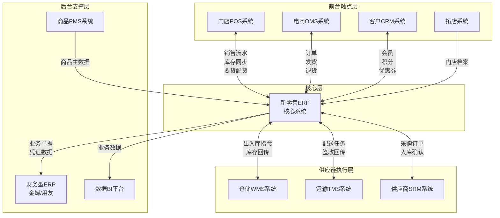

# 维他很忙 - 系统功能清单和上下游集成系统

> **文档类型**: 系统架构资料  
> **最后更新**: 2025-12-28  
> **适用范围**: ERP项目重构 - 系统集成规划

---

## 一、新零售ERP核心功能模块清单

### 1.1 商品中心(PMS集成)
+ **商品主数据管理**
+ **商品分类与属性管理**
+ **多价格体系管理**
+ **批次与效期管理**
+ **商品生命周期管理**
+ **供应商商品目录管理**

### 1.2 库存中心
+ **多组织库存管理**(总部/区域/门店)
+ **多温区库存管理**(常温/冷藏/冷冻)
+ **库存预警与补货策略**
+ **调拨管理**(跨仓/跨门店/组织间)
+ **盘点与库存调整**
+ **在途库存管理**
+ **临期与损耗管理**

### 1.3 采购管理
+ **采购计划管理**
+ **采购订单管理**
+ **供应商管理**(准入/绩效/合同)
+ **质检管理**
+ **采购退货管理**
+ **采购结算与对账**

### 1.4 销售与订单中心
+ **多渠道订单管理**(门店/电商/O2O/批发)
+ **订单路由与分单**
+ **订单履约管理**
+ **促销订单处理**
+ **销售退货管理**
+ **订单统计分析**

### 1.5 门店运营(POS集成)
+ **门店库存管理**
+ **门店补货管理**
+ **门店收货管理**
+ **门店盘点管理**
+ **门店报损管理**
+ **门店销售数据同步**

### 1.6 仓储管理(WMS集成)
+ **入库管理**(采购/退货/调拨/其他)
+ **出库管理**(销售/调拨/报损/其他)
+ **库内作业**(上架/移库/盘点)
+ **库位管理**
+ **波次管理**

### 1.7 物流配送(TMS集成)
+ **配送计划管理**
+ **运输任务管理**
+ **承运商管理**
+ **配送异常处理**
+ **运费结算**

### 1.8 会员与营销(CRM集成)
+ **会员档案管理**
+ **会员等级与积分**
+ **优惠券管理**
+ **促销活动管理**
+ **营销效果分析**

### 1.9 财务结算(财务ERP集成)
+ **应收应付管理**
+ **成本核算**
+ **结算单管理**
+ **财务凭证对接**
+ **损益分析**

### 1.10 报表与BI
+ **经营驾驶舱**
+ **销售分析报表**
+ **库存分析报表**
+ **采购分析报表**
+ **门店分析报表**
+ **会员分析报表**

---

## 二、上下游集成系统全景图

---

## 三、关键系统集成说明

### 3.1 POS系统集成(最高优先级)

#### 系统定义
+ **作用**: 门店收银与店务管理
+ **用户**: 收银员、店长、理货员
+ **核心价值**: 门店数字化终端

#### 核心集成接口

| 接口名称 | 方向 | 频率 | 说明 |
|---------|------|-----|------|
| 商品价格同步 | ERP→POS | 实时 | 商品档案、价格、促销规则 |
| 门店要货单 | POS→ERP | 实时 | 门店补货申请 |
| 门店配货单 | ERP→POS | 实时 | 配货单及发货信息 |
| 销售流水 | POS→ERP | 实时 | 交易明细上传 |
| 门店盘点单 | POS→ERP | 实时 | 盘点结果上传 |
| 门店报损单 | POS→ERP | 实时 | 报损申请上传 |

#### 关键业务流程
1. **门店要货流程**: 门店发起→ERP审核→生成配货单→WMS发货→门店收货
2. **销售流水**: POS收银→实时上传→ERP库存扣减→财务记账
3. **门店盘点**: ERP下发任务→POS盘点录入→上传结果→ERP调整库存

### 3.2 电商OMS集成(高优先级)

#### 系统定义
+ **作用**: 全渠道订单管理
+ **用户**: 电商运营、客服、审单专员
+ **核心价值**: 多平台订单统一处理

#### 核心集成接口

| 接口名称 | 方向 | 频率 | 说明 |
|---------|------|-----|------|
| 商品库存同步 | ERP→OMS | 每5分钟 | 各仓库可售库存 |
| 销售订单 | OMS→ERP | 实时 | 审单后的标准订单 |
| 销售出库单 | OMS→ERP | 实时 | 出库指令 |
| 发货确认 | WMS→OMS→ERP | 实时 | 发货信息回传 |
| 退货入库单 | OMS→ERP | 实时 | 退货商品信息 |

#### 关键业务流程
1. **订单履约**: 平台下单→OMS接单→智能分仓→ERP出库→WMS发货→回传物流号
2. **库存同步**: ERP库存变动→推送OMS→OMS更新可售库存→同步到各平台
3. **退货处理**: 客户申请→OMS审核→退货入库→ERP库存增加→退款处理

### 3.3 WMS系统集成(最高优先级)

#### 系统定义
+ **作用**: 仓库作业管理
+ **用户**: 仓管员、理货员、质检员
+ **核心价值**: 库位级精细化管理

#### 核心集成接口

| 接口名称 | 方向 | 频率 | 说明 |
|---------|------|-----|------|
| 商品档案同步 | ERP→WMS | 实时 | 商品基础信息、箱规 |
| 采购ASN | ERP→WMS | 实时 | 预计到货通知 |
| 入库确认 | WMS→ERP | 实时 | 实收数量、批次 |
| 销售DN | ERP→WMS | 实时 | 出库指令 |
| 出库确认 | WMS→ERP | 实时 | 实发数量、运单号 |
| 盘点任务 | ERP→WMS | 按需 | 盘点范围 |
| 盘点结果 | WMS→ERP | 实时 | 盘盈盘亏数据 |

#### 关键业务流程
1. **采购入库**: ERP下达PO→推送ASN给WMS→供应商送货→WMS收货上架→回传入库确认→ERP增加库存
2. **销售出库**: ERP推送DN→WMS拣货打包→WMS发货→回传出库确认→ERP扣减库存
3. **库存盘点**: ERP发起盘点→WMS执行→回传盘点结果→ERP生成损益单

### 3.4 CRM系统集成(中优先级)

#### 系统定义
+ **作用**: 会员与营销管理
+ **用户**: 会员运营、市场部
+ **核心价值**: One ID会员体系

#### 核心集成接口

| 接口名称 | 方向 | 频率 | 说明 |
|---------|------|-----|------|
| 会员档案同步 | CRM↔ERP | 实时 | 会员信息、等级、余额 |
| 交易明细推送 | ERP→CRM | 实时 | 用于积分计算 |
| 积分变动 | CRM→ERP | 实时 | 积分增减记录 |
| 优惠券核销 | ERP→CRM | 实时 | 券码验证使用 |
| 促销规则同步 | CRM→ERP | 实时 | 促销活动配置 |

### 3.5 财务ERP集成(高优先级)

#### 系统定义
+ **作用**: 总账与财务核算
+ **用户**: 财务会计、CFO
+ **核心价值**: 业财一体化

#### 核心集成接口

| 接口名称 | 方向 | 频率 | 说明 |
|---------|------|-----|------|
| 采购入库单 | ERP→财务 | 每日 | 生成应付暂估 |
| 采购发票 | ERP→财务 | 实时 | 应付发票录入 |
| 销售出库单 | ERP→财务 | 每日 | 确认收入成本 |
| 零售日结单 | ERP→财务 | 每日 | 门店收款单 |
| 盘盈盘亏单 | ERP→财务 | 实时 | 财产损溢 |

---

## 四、集成技术方案

### 4.1 集成模式
+ **实时接口**: Restful API(HTTPS)
+ **批量接口**: 文件传输(SFTP) + 定时任务
+ **消息队列**: RabbitMQ/Kafka(高频场景)
+ **数据库同步**: 中间表方式(财务系统)

### 4.2 数据一致性策略
+ **库存扣减**: ERP为准,实时强一致性
+ **会员数据**: CRM为准,实时同步
+ **商品主数据**: PMS为准,广播分发
+ **财务数据**: 单据级对账,T+1核对

### 4.3 异常处理
+ **超时重试**: 3次重试机制
+ **补偿机制**: 差异对账+人工处理
+ **断点续传**: 支持数据恢复
+ **监控告警**: 接口失败实时告警

---

## 五、系统优先级与实施路线

### Phase 1 (P0 - 核心系统 - 6个月)
1. ERP核心模块(商品/库存/采购/销售)
2. POS集成(门店要货/销售流水)
3. WMS集成(出入库)

### Phase 2 (P1 - 渠道扩展 - 3个月)
4. 电商OMS集成
5. CRM集成(会员/营销)
6. 基础报表

### Phase 3 (P2 - 全面优化 - 3个月)
7. 财务ERP集成(业财一体化)
8. TMS/SRM集成
9. BI数据分析平台
