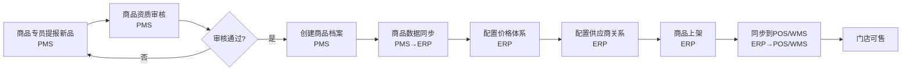
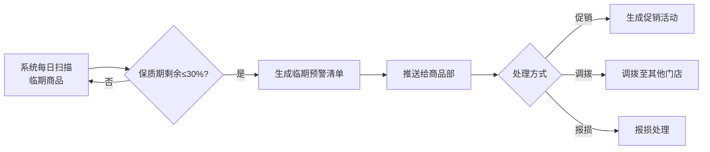
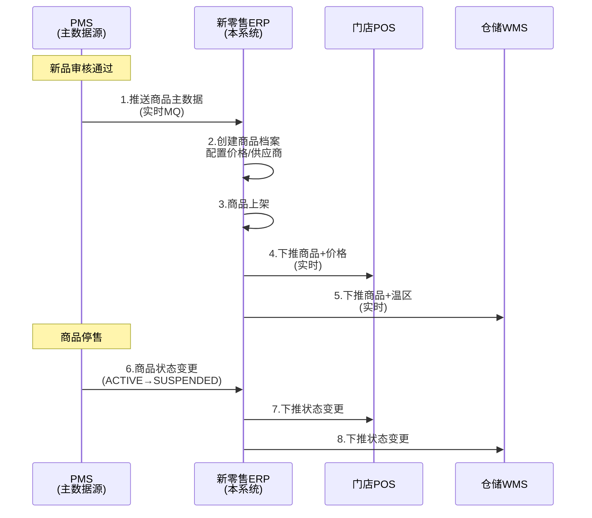
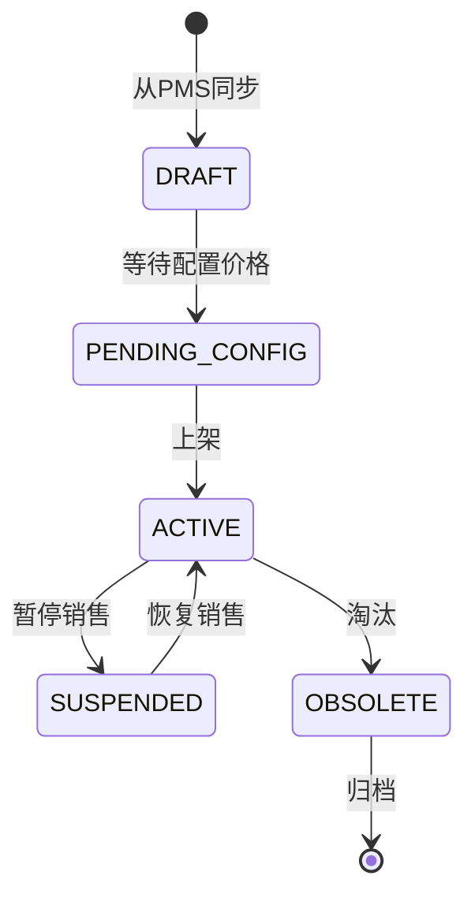

# 商品管理模块PRD - 主档

> **文档状态**: 评审中  
> **版本**: v1.0.0  
> **作者**: 产品团队  
> **创建日期**: 2025-12-28  
> **更新日期**: 2025-12-28  
> **评审人**: 业务/研发/测试  
> **相关链接**: 
> - [附件A: 数据模型与数据字典](./附件A_数据模型与数据字典.md)
> - [附件C: 页面与交互说明](./附件C_页面与交互说明.md)
> - [附件E: 规则总表](./附件E_规则总表.md)

---

## 0. 文档管理

### 0.1 变更记录（Changelog）
| 版本 | 日期 | 变更人 | 变更内容 | 影响范围 | 备注 |
|---|---|---|---|---|---|
| v1.0.0 | 2025-12-28 | 产品团队 | 初始版本 | 全部 | 商品管理模块首版PRD |

### 0.2 术语与口径
| 术语 | 定义 | 备注 |
|---|---|---|
| SKU | Stock Keeping Unit，最小库存单位 | 一个SKU代表一个独立商品 |
| 批次 | 同一生产日期的商品批号 | 用于质量追溯 |
| 临期 | 保质期剩余≤30%的商品 | 需要预警和促销 |
| 温区 | 商品存储温度要求 | NORMAL常温/COLD冷藏/FROZEN冷冻 |
| 箱规 | 一箱包含的销售单位数量 | 如：12瓶/箱 |
| FEFO | First Expired First Out，先到期先出 | 库存出库策略 |

详细术语见 [3. 常用术语&名词表.md](../../docs/3.%20常用术语&名词表.md)

### 0.3 开放问题与决策记录
| 编号 | 问题/决策点 | 选项 | 建议方案 | 决策人 | 截止时间 | 状态 |
|---|---|---|---|---|---|---|
| Q1 | 商品编码规则是否需要支持多套规则 | A.单套规则 B.多套规则按类别 | B | 商品部 | 2026-01-10 | 待决策 |
| Q2 | 临期预警天数是否可配置 | A.固定30% B.可配置 | B | 商品部 | 2026-01-10 | 待决策 |

---

## 1. 项目概述

### 1.1 背景与现状（Why）

**现状描述**：
- 维他很忙当前拥有5000+ SKU，涵盖休闲零食、饮品、冷冻冷藏、进口零食等多个品类
- 商品数据分散在多个系统（PMS、ERP、POS、WMS），数据不一致问题频发
- 新品引入流程线下流转，周期长达2-4周，错过市场机会
- 商品档案维护混乱，缺少统一的主数据管理

**关键痛点**：
1. **数据不一致**：PMS、ERP、POS三个系统的商品信息经常不同步，导致价格、库存错误
2. **批次管理缺失**：无法有效管理批次和保质期，过期商品损耗严重（年损失约500万）
3. **临期预警不及时**：无自动化临期预警机制，发现临期时已无法促销
4. **新品引入慢**：新品引入流程线下审批，周期长，效率低
5. **多温区管理混乱**：常温/冷藏/冷冻商品混放，影响商品质量

**影响**：
- **成本损失**：过期和临期损耗约500万/年
- **效率损失**：新品引入周期长，错过销售旺季
- **风险**：食品安全事故风险，监管不合规风险
-**体验**：门店缺货/价格错误影响顾客体验

### 1.2 目标与价值（What / Value）

**业务目标（可量化）**：
- 商品主数据一致性达到99.9%
- 临期商品损耗率降低50%（从2%→1%）
- 新品引入周期缩短60%（从21天→8天）
- 批次追溯覆盖率100%（食品安全合规要求）

**用户目标**：
- **商品部**：快速引入新品，统一管理商品全生命周期
- **采购部**：准确的供应商商品目录，支持采购决策
- **门店**：准确的商品信息和价格，避免错误
- **质检**：完整的批次追溯，保障食品安全

**系统目标**：
- 建立商品主数据中心，成为商品信息唯一权威源
- 与PMS、POS、WMS等系统无缝集成
- 支持5000+ SKU高效管理，可扩展至10000+ SKU

### 1.3 成功指标与口径
| 指标 | 定义/计算口径 | 数据来源系统 | 统计周期 | 基线值 | 目标值 |
|---|---|---|---|---|---|
| 商品数据一致性 | (ERP-PMS-POS数据一致的商品数/总商品数)×100% | ERP+PMS+POS | 每日 | 90% | 99.9% |
| 临期损耗率 | 临期报损金额/总库存金额×100% | ERP库存+报损单 | 每月 | 2% | 1% |
| 新品引入周期 | 新品提报→上架可售平均天数 | PMS工作流 | 每月 | 21天 | 8天 |
| 批次追溯覆盖率 | 有批次号的商品出库数/总出库数×100% | ERP出库单 | 每月 | 60% | 100% |
| 商品档案完整率 | 必填字段完整的SKU/总SKU×100% | ERP商品表 | 每周 | 85% | 98% |

### 1.4 范围边界（Scope）

**In Scope**
- 商品主数据管理（编码、名称、分类、属性、图片等）
- 商品生命周期管理（新品引入、试销、上架、淘汰）
- 批次与效期管理（批次号、生产日期、保质期、临期预警）
- 多价格体系管理（总部价、区域价、门店价、会员价、促销价）
- 供应商商品目录管理（供应商-商品映射、合同价、供货周期）
- 商品多温区管理（常温/冷藏/冷冻分类）
- 商品分类与品牌管理
- 商品档案审核与发布
- 与PMS商品主数据同步

**Out of Scope**
- 商品图片拍摄与处理（由商品部自行处理）
- 商品寻源与开发（属于商品开发流程，非系统功能）
- 库存管理（属于库存模块）
- 价格促销活动（属于营销模块）
- 商品评价与评分（属于CRM/电商模块）

**约束条件**
- **时间约束**：Phase 1需在3个月内上线（2026-04-01前）
- **技术约束**：必须与现有PMS系统集成，PMS为商品主数据源
- **合规约束**：必须符合食品安全追溯法规要求
- **资源约束**：开发团队3人，测试1人
- **历史数据**：需迁移现有5000+ SKU历史数据

---

## 2. 业务概览（面向"共识"）

### 2.1 业务参与方与组织模型

**组织层级**：
- 总部商品部
- 区域公司（可选，部分区域商品）
- 供应商（外部）

**关键角色**：
- **商品专员**：负责新品引入、商品档案维护
- **商品主管**：负责商品审核、上下架决策
- **商品总监**：负责商品策略、淘汰决策
- **采购员**：使用供应商商品目录采购
- **门店店长**：使用商品信息进行销售
- **质检员**：查看批次信息进行质量追溯

详细权限见 [附件B: 权限与审计](./附件B_权限与审计.md)

**涉及系统**：
- **PMS（商品资料管理系统）**：商品主数据源，商品新品引入流程
- **ERP（本系统）**：接收PMS商品数据，管理商品价格、批次、供应商关系
- **POS（门店收银系统）**：使用商品信息和价格
- **WMS（仓储管理系统）**：使用商品信息、批次、温区要求
- **电商OMS**：使用商品信息和库存

详细集成见 [附件D: 接口契约与集成](./附件D_接口契约与集成.md)

### 2.2 端到端业务流程概览

#### 主流程：新品引入与上架



**关键节点**：
1. 商品提报（PMS）
2. 资质审核（PMS，法务/质检/商务）
3. 商品建档（PMS，生成商品编码）
4. 数据同步（PMS→ERP，实时/准实时）
5. 价格配置（ERP，多价格体系）
6. 供应商配置（ERP，采购合同价）
7. 商品上架（ERP，设置上架门店/渠道）
8. 下推终端（ERP→POS/WMS）

**关键异常分支**：
- 资质审核不通过 → 补充资料或放弃
- 商品编码重复 → PMS修正
- 数据同步失败 → 重试机制+人工介入
- 价格未配置 → 阻断上架

#### 辅助流程：临期预警与处理



详细流程见 [4. 核心业务流程详解.md](../../docs/4.%20核心业务流程详解.md)

### 2.3 多系统交互概览



**同步/异步**：
- PMS→ERP：异步消息队列（MQ），准实时（延迟<30秒）
- ERP→POS/WMS：实时接口调用

**一致性策略**：
- 商品主数据：最终一致性，PMS为权威源
- 价格数据：强一致性，ERP为权威源
- 库存数据：强一致性，ERP（账）+WMS（位）

**补偿机制**：
- 消息失败重试（3次）
- 数据对账（T+1全量对账）
- 人工补录通道

详细见 [6. 系统功能清单和上下游集成系统.md](../../docs/6.%20系统功能清单和上下游集成系统.md)

---

## 3. 方案概述（面向"做什么、怎么落地"）

### 3.1 功能结构（模块树）

```
商品管理模块
├── 商品主数据管理
│   ├── 商品档案管理
│   ├── 商品分类管理
│   ├── 商品品牌管理
│   └── 商品属性管理
├── 商品生命周期管理
│   ├── 新品引入（接收PMS数据）
│   ├── 商品上架/下架
│   ├── 商品试销管理
│   └── 商品淘汰管理
├── 批次与效期管理
│   ├── 批次号规则配置
│   ├── 保质期管理
│   ├── 临期预警配置
│   └── 临期商品清单
├── 价格管理
│   ├── 多价格体系配置
│   ├── 价格生效时间管理
│   ├── 价格变更历史
│   └── 价格下推POS
└── 供应商商品管理
    ├── 供应商商品目录
    ├── 合同价管理
    ├── 供货周期管理
    └── 供应商商品绩效
```

### 3.2 核心用例（User Story）

#### 用例1：商品专员接收PMS新品并配置价格
**作为**商品专员  
**我想**在ERP中接收PMS同步的新品，并配置价格体系  
**以便**新品可以在门店销售

**前置条件**：PMS已审核通过新品并推送到ERP

**主流程**：
1. 系统接收PMS新品数据（MQ消息）
2. 商品专员在"待配置商品清单"中查看新品
3. 商品专员配置总部价、区域价、会员价
4. 商品专员保存价格配置
5. 系统生成价格生效记录
6. 商品状态变更为"待上架"

**后置条件**：商品有了完整价格体系，可以上架销售

#### 用例2：系统自动扫描并预警临期商品
**作为**系统  
**我想**每日自动扫描临期商品并发送预警  
**以便**商品部及时处理，减少损耗

**前置条件**：系统已配置临期预警规则（保质期剩余≤30%）

**主流程**：
1. 系统每日凌晨2点扫描所有批次库存
2. 计算每个批次的保质期剩余比例
3. 筛选保质期剩余≤30%的商品
4. 生成临期商品清单
5. 推送消息给商品部（站内信+邮件）
6. 商品部查看清单并处理

**后置条件**：商品部收到临期预警，可及时处理

更多用例见 [附件F: 测试与验收](./附件F_测试与验收.md)

### 3.3 核心流程（详细）

详细流程已在2.2节展示，更详细的流程图见图稿包。

### 3.4 核心数据对象（概览）

**主要对象**：
- **商品（Product）**：商品主数据，参考 [5. 数据模型与业务对象.md](../../docs/5.%20数据模型与业务对象.md) 2.1节
- **商品分类（Category）**：商品分类树
- **商品品牌（Brand）**：品牌信息
- **商品价格（Price）**：多价格体系
- **供应商商品（SupplierProduct）**：供应商-商品映射关系
- **批次（Batch）**：商品批次信息（可能在库存模块）

详细数据模型见 [附件A: 数据模型与数据字典](./附件A_数据模型与数据字典.md)

### 3.5 核心规则（概览）

**关键业务规则**：
1. **商品编码规则**：由PMS生成，ERP不可修改
2. **临期预警规则**：保质期剩余≤30%触发预警
3. **价格生效规则**：价格变更需指定生效时间，生效前可修改
4. **上架规则**：必须配置价格、供应商、分类后才能上架
5. **批次管理规则**：食品类必须批次管理，非食品可选

所有规则详见 [附件E: 规则总表](./附件E_规则总表.md)

### 3.6 关键状态机（概览）

**商品状态流转**：



状态说明见 [附件A: 数据模型与数据字典](./附件A_数据模型与数据字典.md)

---

## 4. 非功能需求（NFR）

### 4.1 性能需求
- **响应时间**：商品查询<1秒，商品保存<2秒
- **并发**：支持100个用户同时在线操作
- **数据量**：支持10000+ SKU
- **同步时效**：PMS→ERP消息延迟<30秒

### 4.2 可用性需求
- **系统可用性**：≥99.5%（除计划维护外）
- **数据准确性**：商品主数据一致性≥99.9%

### 4.3 安全性需求
- **权限控制**：基于角色的权限管理（RBAC）
- **数据脱敏**：供应商合同价格仅特定角色可见
- **操作审计**：关键操作（上架/下架/价格变更）留痕

### 4.4 可维护性需求
- **配置化**：临期预警天数可配置
- **监控告警**：PMS同步失败实时告警
- **日志审计**：保留6个月操作日志

---

## 5. 迭代计划与里程碑

### Phase 1（MVP - 3个月）
**目标**：核心商品管理功能上线

**功能范围**：
- 商品档案管理（接收PMS、查询、修改）
- 商品分类与品牌管理
- 批次与效期管理（基础）
- 单价格体系（总部价）
- 与PMS/POS/WMS集成

**里程碑**：
- Month 1：需求确认+设计评审
- Month 2：开发+集成测试
- Month 3：UAT+上线

### Phase 2（增强 - 2个月）
**目标**：多价格体系+临期预警

**功能范围**：
- 多价格体系（区域价、门店价、会员价）
- 临期预警自动化
- 供应商商品目录管理

**里程碑**：
- Month 4：开发
- Month 5：测试+上线

### Phase 3（优化 - 1个月）
**目标**：商品生命周期管理完善

**功能范围**：
- 试销管理
- 淘汰流程
- 商品绩效分析

---

## 6. 风险与应对

| 风险 | 概率 | 影响 | 应对措施 |
|------|------|------|---------|
| PMS接口不稳定 | 高 | 高 | 1.增加重试机制 2.定时全量对账 |
| 历史数据质量差 | 中 | 高 | 1.数据清洗脚本 2.人工review |
| 价格配置复杂度高 | 中 | 中 | 1.Phase分阶段上 2.提供模板 |
| 用户变更抵触 | 低 | 中 | 1.充分培训 2.提供操作手册 |

---

## 7. 附件索引

| 附件 | 文件名 | 说明 |
|------|--------|------|
| 附件A | 数据模型与数据字典 | 表结构、字段、枚举、ER图 |
| 附件B | 权限与审计 | 角色权限矩阵、审计规则 |
| 附件C | 页面与交互说明 | UI详细设计 |
| 附件D | 接口契约与集成 | API设计、集成方案 |
| 附件E | 规则总表 | 所有业务规则汇总 |
| 附件F | 测试与验收 | 测试用例、UAT计划 |
| 附件G | 上线与运维 | 上线方案、监控告警 |

---

**评审结论**：
- [ ] 通过，进入开发
- [ ] 有条件通过，需补充：________
- [ ] 不通过，需重新评审

**评审签字**：
- 业务：________
- 研发：________
- 测试：________
- 日期：________
