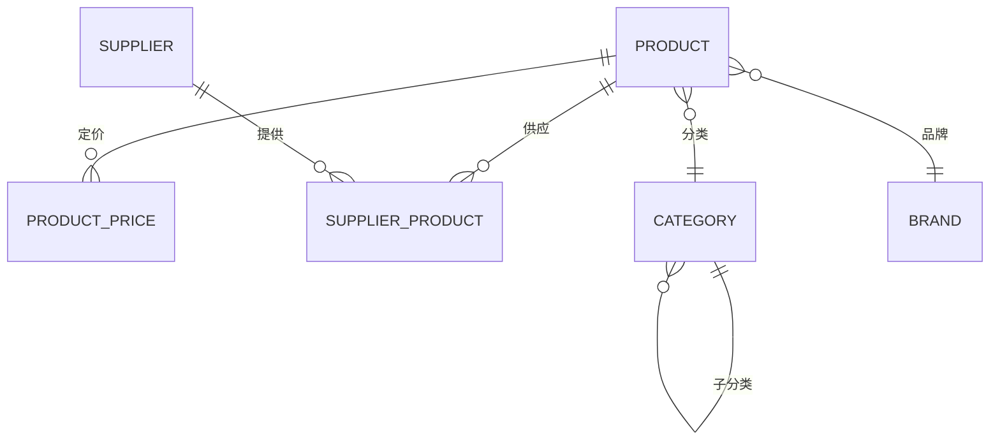
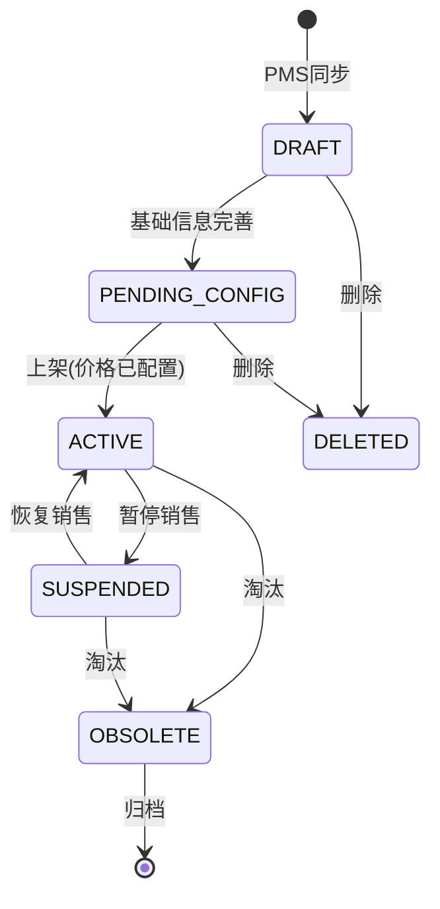

# 附件A: 数据模型与数据字典

> **PRD主档**: [PRD_Main.md](./PRD_Main.md)  
> **版本**: v1.0.0  
> **更新日期**: 2025-12-28

---

## 1. 数据模型总览（ER图）



---

## 2. 核心数据表

### 2.1 商品主表（product）

**表说明**：商品主数据表，存储商品的基础信息。

| 字段英文名 | 字段中文名 | 类型 | 长度 | 必填 | 默认值 | 说明 |
|-----------|-----------|------|------|------|--------|------|
| product_id | 商品ID | BIGINT | - | 是 | 自增 | 主键 |
| product_code | 商品编码 | VARCHAR | 32 | 是 | - | 业务编码，唯一，来自PMS |
| product_name | 商品名称 | VARCHAR | 200 | 是 | - | 全称 |
| product_short_name | 商品简称 | VARCHAR | 50 | 否 | - | 门店POS显示用 |
| barcode | 条码 | VARCHAR | 20 | 是 | - | EAN-13/EAN-8，唯一 |
| category_id | 分类ID | BIGINT | - | 是 | - | 外键→category |
| brand_id | 品牌ID | BIGINT | - | 否 | - | 外键→brand |
| spec | 规格 | VARCHAR | 100 | 否 | - | 如"500g"、"330ml×12罐" |
| unit | 销售单位 | VARCHAR | 10 | 是 | - | 如"瓶"、"袋"、"盒" |
| case_pack | 箱规 | INT | - | 是 | 1 | 一箱多少个销售单位 |
| shelf_life_days | 保质期天数 | INT | - | 是 | - | 如365天 |
| temperature_zone | 温区 | VARCHAR | 10 | 是 | NORMAL | 枚举：见2.2节 |
| is_batch_managed | 是否批次管理 | TINYINT | - | 是 | 1 | 0否/1是 |
| is_weight_item | 是否称重商品 | TINYINT | - | 是 | 0 | 0否/1是 |
| image_url | 商品图片 | VARCHAR | 500 | 否 | - | CDN地址 |
| description | 商品描述 | TEXT | - | 否 | - | 详细描述 |
| status | 状态 | VARCHAR | 20 | 是 | DRAFT | 枚举：见2.3节 |
| source_system | 来源系统 | VARCHAR | 20 | 是 | PMS | PMS/MANUAL |
| pms_product_id | PMS商品ID | VARCHAR | 50 | 否 | - | PMS系统的商品ID |
| created_at | 创建时间 | DATETIME | - | 是 | NOW() | 系统时间 |
| updated_at | 更新时间 | DATETIME | 是 | NOW() | 系统时间 |
| created_by | 创建人 | BIGINT | - | 是 | - | 用户ID |
| updated_by | 更新人 | BIGINT | - | 是 | - | 用户ID |

**索引**：
- 主键索引：product_id
- 唯一索引：product_code
- 唯一索引：barcode
- 普通索引：category_id, brand_id, status, pms_product_id

**约束**：
- product_code格式：由PMS生成，不可手动修改
- barcode格式：必须符合EAN-13或EAN-8标准
- shelf_life_days：必须>0
- case_pack：必须>0

---

### 2.2 温区枚举值（temperature_zone）

| 枚举值 | 中文名称 | 温度范围 | 说明 |
|--------|---------|---------|------|
| NORMAL | 常温 | 10-30℃ | 常温存储和运输 |
| COLD | 冷藏 | 2-8℃ | 需要冷藏车配送 |
| FROZEN | 冷冻 | -18℃以下 | 需要冷冻车配送 |

---

### 2.3 商品状态枚举（status）

| 枚举值 | 中文名称 | 说明 | 可执行操作 |
|--------|---------|------|-----------|
| DRAFT | 草稿 | 从PMS同步，待配置 | 配置价格、删除 |
| PENDING_CONFIG | 待配置 | 等待配置价格/供应商 | 配置、删除 |
| ACTIVE | 已上架 | 正常销售中 | 下架、修改价格 |
| SUSPENDED | 已暂停 | 暂停销售 | 恢复上架、淘汰 |
| OBSOLETE | 已淘汰 | 不再销售 | 归档 |
| DELETED | 已删除 | 软删除 | - |

**状态流转图**：



---

### 2.4 商品分类表（category）

**表说明**：商品分类树，支持多级分类。

| 字段英文名 | 字段中文名 | 类型 | 长度 | 必填 | 默认值 | 说明 |
|-----------|-----------|------|------|------|--------|------|
| category_id | 分类ID | BIGINT | - | 是 | 自增 | 主键 |
| category_code | 分类编码 | VARCHAR | 32 | 是 | - | 业务编码，唯一 |
| category_name | 分类名称 | VARCHAR | 100 | 是 | - | 分类名称 |
| parent_id | 父分类ID | BIGINT | - | 否 | NULL | 外键→category，NULL表示顶级 |
| level | 层级 | INT | - | 是 | 1 | 1一级/2二级/3三级 |
| sort_order | 排序 | INT | - | 是 | 0 | 同级排序 |
| is_enabled | 是否启用 | TINYINT | - | 是 | 1 | 0否/1是 |
| created_at | 创建时间 | DATETIME | - | 是 | NOW() | 系统时间 |
| updated_at | 更新时间 | DATETIME | - | 是 | NOW() | 系统时间 |

**示例数据**：
```
- 休闲零食 (category_id=1, parent_id=NULL, level=1)
  - 坚果炒货 (category_id=11, parent_id=1, level=2)
    - 夏威夷果 (category_id=111, parent_id=11, level=3)
    - 碧根果 (category_id=112, parent_id=11, level=3)
  - 膨化食品 (category_id=12, parent_id=1, level=2)
```

---

### 2.5 商品品牌表（brand）

**表说明**：商品品牌主数据。

| 字段英文名 | 字段中文名 | 类型 | 长度 | 必填 | 默认值 | 说明 |
|-----------|-----------|------|------|------|--------|------|
| brand_id | 品牌ID | BIGINT | - | 是 | 自增 | 主键 |
| brand_code | 品牌编码 | VARCHAR | 32 | 是 | - | 业务编码，唯一 |
| brand_name | 品牌名称 | VARCHAR | 100 | 是 | - | 品牌名称 |
| brand_name_en | 品牌英文名 | VARCHAR | 100 | 否 | - | 英文名称 |
| logo_url | 品牌Logo | VARCHAR | 500 | 否 | - | CDN地址 |
| country | 品牌国家 | VARCHAR | 50 | 否 | - | 如"中国"、"美国" |
| is_enabled | 是否启用 | TINYINT | - | 是 | 1 | 0否/1是 |
| created_at | 创建时间 | DATETIME | - | 是 | NOW() | 系统时间 |
| updated_at | 更新时间 | DATETIME | - | 是 | NOW() | 系统时间 |

---

### 2.6 商品价格表（product_price）

**表说明**：商品多价格体系，支持总部价、区域价、门店价、会员价等。

| 字段英文名 | 字段中文名 | 类型 | 长度 | 必填 | 默认值 | 说明 |
|-----------|-----------|------|------|------|--------|------|
| price_id | 价格ID | BIGINT | - | 是 | 自增 | 主键 |
| product_id | 商品ID | BIGINT | - | 是 | - | 外键→product |
| price_type | 价格类型 | VARCHAR | 20 | 是 | - | 枚举：见下表 |
| org_id | 组织ID | BIGINT | - | 否 | NULL | 区域/门店ID，NULL表示总部价 |
| price | 价格 | DECIMAL | 18,2 | 是 | - | 销售价格 |
| effective_date | 生效日期 | DATE | - | 是 | - | 价格生效日期 |
| expiry_date | 失效日期 | DATE | - | 否 | NULL | NULL表示长期有效 |
| is_active | 是否启用 | TINYINT | - | 是 | 1 | 0否/1是 |
| created_at | 创建时间 | DATETIME | - | 是 | NOW() | 系统时间 |
| updated_at | 更新时间 | DATETIME | - | 是 | NOW() | 系统时间 |
| created_by | 创建人 | BIGINT | - | 是 | - | 用户ID |

**价格类型枚举（price_type）**：

| 枚举值 | 中文名称 | 说明 |
|--------|---------|------|
| HQ_PRICE | 总部价 | 全国统一价格 |
| REGION_PRICE | 区域价 | 区域公司价格 |
| STORE_PRICE | 门店价 | 特定门店价格 |
| MEMBER_PRICE | 会员价 | 会员专享价格 |
| PROMOTION_PRICE | 促销价 | 促销活动价格 |

**价格优先级规则**：
```
促销价 > 门店价 > 区域价 > 会员价 > 总部价
```

**约束**：
- 同一商品+同一价格类型+同一组织，有效期不能重叠
- 价格必须≥0
- effective_date ≤ expiry_date

---

### 2.7 供应商商品表（supplier_product）

**表说明**：供应商与商品的映射关系，记录采购合同价、供货周期等。

| 字段英文名 | 字段中文名 | 类型 | 长度 | 必填 | 默认值 | 说明 |
|-----------|-----------|------|------|------|--------|------|
| sp_id | 供应商商品ID | BIGINT | - | 是 | 自增 | 主键 |
| supplier_id | 供应商ID | BIGINT | - | 是 | - | 外键→supplier |
| product_id | 商品ID | BIGINT | - | 是 | - | 外键→product |
| supplier_product_code | 供应商商品编码 | VARCHAR | 50 | 否 | - | 供应商的商品编码 |
| contract_price | 合同价 | DECIMAL | 18,4 | 是 | - | 采购合同价 |
| tax_rate | 税率 | DECIMAL | 5,2 | 是 | 13.00 | 如13% |
| lead_time_days | 供货周期（天） | INT | - | 是 | - | 下单到到货天数 |
| moq | 最小起订量 | DECIMAL | 18,4 | 否 | - | Minimum Order Quantity |
| is_primary | 是否主供应商 | TINYINT | - | 是 | 0 | 0否/1是 |
| is_active | 是否启用 | TINYINT | - | 是 | 1 | 0否/1是 |
| effective_date | 生效日期 | DATE | - | 是 | - | 合同生效日期 |
| expiry_date | 失效日期 | DATE | - | 否 | NULL | 合同到期日期 |
| created_at | 创建时间 | DATETIME | - | 是 | NOW() | 系统时间 |
| updated_at | 更新时间 | DATETIME | - | 是 | NOW() | 系统时间 |

**约束**：
- 一个商品可以有多个供应商，但只能有一个主供应商（is_primary=1）
- contract_price必须>0
- lead_time_days必须>0

---

## 3. 数据字典汇总

### 3.1 所有枚举值汇总

| 枚举字段 | 枚举值 | 中文名称 |
|---------|--------|---------|
| temperature_zone | NORMAL | 常温 |
|  | COLD | 冷藏 |
|  | FROZEN | 冷冻 |
| status | DRAFT | 草稿 |
|  | PENDING_CONFIG | 待配置 |
|  | ACTIVE | 已上架 |
|  | SUSPENDED | 已暂停 |
|  | OBSOLETE | 已淘汰 |
|  | DELETED | 已删除 |
| price_type | HQ_PRICE | 总部价 |
|  | REGION_PRICE | 区域价 |
|  | STORE_PRICE | 门店价 |
|  | MEMBER_PRICE | 会员价 |
|  | PROMOTION_PRICE | 促销价 |

### 3.2 字段命名规范

参考 [5. 数据模型与业务对象.md](../../docs/5.%20数据模型与业务对象.md) 第三章

**统一后缀**：
- `_id`: 主键ID、外键ID
- `_code`: 业务编码
- `_name`: 名称
- `_at`: 时间戳（created_at, updated_at）
- `_by`: 操作人（created_by, updated_by）
- `_date`: 日期（effective_date）
- `_url`: URL地址（image_url）

---

## 4. 数据关系说明

### 4.1 商品-分类关系
- **关系类型**：多对一（Many-to-One）
- **说明**：一个商品属于一个分类，一个分类包含多个商品
- **外键**：product.category_id → category.category_id

### 4.2 商品-品牌关系
- **关系类型**：多对一（Many-to-One）
- **说明**：一个商品属于一个品牌，一个品牌包含多个商品
- **外键**：product.brand_id → brand.brand_id

### 4.3 商品-价格关系
- **关系类型**：一对多（One-to-Many）
- **说明**：一个商品有多个价格（不同类型、不同组织）
- **外键**：product_price.product_id → product.product_id

### 4.4 商品-供应商关系
- **关系类型**：多对多（Many-to-Many）
- **说明**：一个商品可以有多个供应商，一个供应商提供多个商品
- **中间表**：supplier_product

---

## 5. 数据迁移说明

### 5.1 历史数据迁移范围
- 现有商品档案：约5000个SKU
- 商品分类：约100个分类
- 商品品牌：约500个品牌
- 价格数据：约5000条

### 5.2 数据清洗规则
- 去重：按barcode去重
- 必填项补全：补全必填字段（如温区、箱规）
- 状态统一：根据当前销售情况设置状态
- 无效数据：长期无销售（>1年）商品设置为OBSOLETE

### 5.3 迁移脚本
```sql
-- 示例：迁移商品主数据
INSERT INTO product (
    product_code, product_name, barcode, category_id, 
    shelf_life_days, temperature_zone, status, created_at
)
SELECT 
    old_code, old_name, old_barcode, new_category_id,
    COALESCE(old_shelf_life, 365), 
    COALESCE(old_temp_zone, 'NORMAL'),
    CASE WHEN last_sale_date > DATE_SUB(NOW(), INTERVAL 30 DAY) 
        THEN 'ACTIVE' ELSE 'SUSPENDED' END,
    NOW()
FROM old_product_table;
```

---

## 6. 数据质量监控

### 6.1 数据完整性监控
- 必填项完整率：≥98%
- 图片完整率：≥90%
- 价格覆盖率：100%（所有ACTIVE商品必须有价格）

### 6.2 数据准确性监控
- PMS-ERP数据一致性：≥99.9%
- 价格数据准确性：100%（与POS比对）

### 6.3 监控报表
- 每日生成数据质量报表
- 异常数据推送给数据管理员
