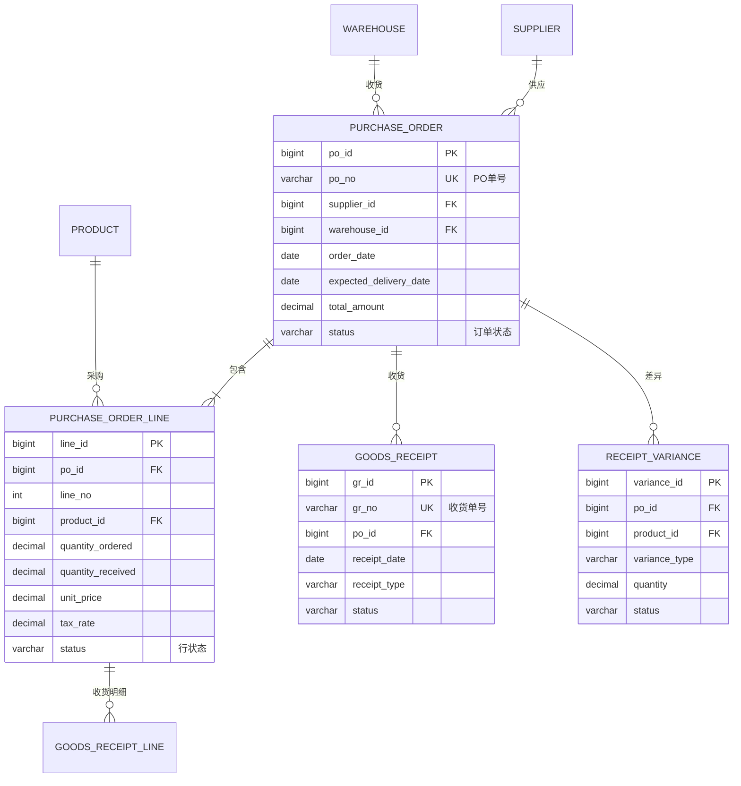
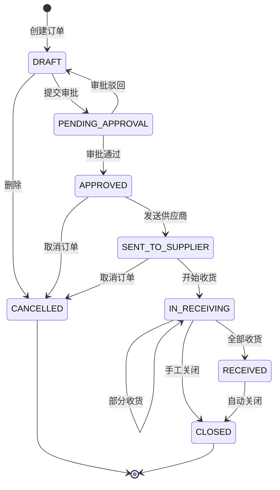

# 附件 A: 数据模型与数据字典

> **PRD 主档**: [PRD_Main.md](./PRD_Main.md)  
> **版本**: v1.0.0  
> **更新日期**: 2025-12-28

---

## 1. 数据模型总览(ER 图)



---

## 2. 核心数据表

### 2.1 采购订单头表(purchase_order)

**表说明**：采购订单主表，存储采购订单的整体信息。

| 字段英文名             | 字段中文名     | 类型     | 长度 | 必填 | 默认值             | 说明                                  |
| ---------------------- | -------------- | -------- | ---- | ---- | ------------------ | ------------------------------------- |
| po_id                  | 采购订单 ID    | BIGINT   | -    | 是   | 自增               | 主键                                  |
| po_no                  | 采购订单号     | VARCHAR  | 32   | 是   | -                  | 业务单号，唯一，格式:PO+YYYYMMDD+序号 |
| supplier_id            | 供应商 ID      | BIGINT   | -    | 是   | -                  | 外键 →supplier                        |
| supplier_name          | 供应商名称     | VARCHAR  | 200  | 是   | -                  | 冗余字段，便于查询                    |
| warehouse_id           | 收货仓库 ID    | BIGINT   | -    | 是   | -                  | 外键 →warehouse                       |
| warehouse_name         | 收货仓库名称   | VARCHAR  | 100  | 是   | -                  | 冗余字段                              |
| order_date             | 订单日期       | DATE     | -    | 是   | -                  | 下单日期                              |
| expected_delivery_date | 期望到货日期   | DATE     | 是   | -    | 要求供应商交货日期 |
| total_amount           | 订单总金额     | DECIMAL  | 18,2 | 是   | 0                  | 含税总金额                            |
| currency               | 币种           | VARCHAR  | 10   | 是   | CNY                | 默认人民币                            |
| payment_term           | 付款条件       | VARCHAR  | 50   | 是   | -                  | 如"月结 30 天"、"货到付款"            |
| payment_term_days      | 账期天数       | INT      | -    | 否   | 0                  | 付款天数                              |
| status                 | 订单状态       | VARCHAR  | 20   | 是   | DRAFT              | 枚举:见 2.2 节                        |
| remark                 | 备注           | TEXT     | -    | 否   | -                  | 采购员备注                            |
| created_by             | 创建人         | BIGINT   | -    | 是   | -                  | 用户 ID                               |
| created_at             | 创建时间       | DATETIME | -    | 是   | NOW()              | 系统时间                              |
| updated_at             | 更新时间       | DATETIME | -    | 是   | NOW()              | 系统时间                              |
| submitted_at           | 提交审批时间   | DATETIME | -    | 否   | -                  | 提交时间                              |
| approved_by            | 审批人         | BIGINT   | -    | 否   | -                  | 用户 ID                               |
| approved_at            | 审批时间       | DATETIME | -    | 否   | -                  | 审批通过时间                          |
| sent_to_supplier_at    | 发送供应商时间 | DATETIME | -    | 否   | -                  | 推送 SRM 时间                         |
| closed_at              | 关闭时间       | DATETIME | -    | 否   | -                  | 订单关闭时间                          |

**索引**：

- 主键索引：po_id
- 唯一索引：po_no
- 普通索引：supplier_id, warehouse_id, status, order_date, expected_delivery_date

**约束**：

- po_no 格式：PO+YYYYMMDD+4 位序号，如 PO20251228-0001
- expected_delivery_date ≥ order_date
- total_amount ≥ 0

---

### 2.2 采购订单状态枚举(status)

| 枚举值           | 中文名称     | 说明           | 可执行操作       |
| ---------------- | ------------ | -------------- | ---------------- |
| DRAFT            | 草稿         | 刚创建，未提交 | 修改、提交、删除 |
| PENDING_APPROVAL | 待审批       | 已提交待审批   | 审批、撤回       |
| APPROVED         | 已审批       | 审批通过       | 发送供应商、取消 |
| SENT_TO_SUPPLIER | 已发送供应商 | 已推送 SRM     | 查看、取消       |
| IN_RECEIVING     | 收货中       | 部分收货       | 查看、关闭       |
| RECEIVED         | 已收货       | 全部收货完成   | 查看、关闭       |
| CLOSED           | 已关闭       | 订单完成或关闭 | 查看             |
| CANCELLED        | 已取消       | 取消采购       | 查看             |

**状态流转图**：



---

### 2.3 采购订单行表(purchase_order_line)

**表说明**：采购订单商品明细行，一个订单包含多行商品。

| 字段英文名        | 字段中文名  | 类型     | 长度 | 必填 | 默认值 | 说明                       |
| ----------------- | ----------- | -------- | ---- | ---- | ------ | -------------------------- |
| line_id           | 行 ID       | BIGINT   | -    | 是   | 自增   | 主键                       |
| po_id             | 采购订单 ID | BIGINT   | -    | 是   | -      | 外键 →purchase_order       |
| line_no           | 行号        | INT      | -    | 是   | -      | 从 1 开始递增              |
| product_id        | 商品 ID     | BIGINT   | -    | 是   | -      | 外键 →product              |
| product_code      | 商品编码    | VARCHAR  | 32   | 是   | -      | 冗余字段                   |
| product_name      | 商品名称    | VARCHAR  | 200  | 是   | -      | 冗余字段                   |
| spec              | 规格        | VARCHAR  | 100  | 否   | -      | 如"500g"、"12 罐/箱"       |
| unit              | 单位        | VARCHAR  | 10   | 是   | -      | 销售单位                   |
| quantity_ordered  | 订购数量    | DECIMAL  | 18,4 | 是   | -      | 采购数量                   |
| quantity_received | 已收货数量  | DECIMAL  | 18,4 | 是   | 0      | 累计收货数量               |
| unit_price        | 采购单价    | DECIMAL  | 18,4 | 是   | -      | 不含税单价                 |
| tax_rate          | 税率        | DECIMAL  | 5,2  | 是   | 13.00  | 如 13%                     |
| tax_amount        | 税额        | DECIMAL  | 18,2 | 是   | -      | =数量 × 单价 × 税率        |
| line_amount       | 行总金额    | DECIMAL  | 18,2 | 是   | -      | =数量 × 单价 ×(1+税率)     |
| status            | 行状态      | VARCHAR  | 20   | 是   | OPEN   | 枚举:OPEN/RECEIVING/CLOSED |
| remark            | 行备注      | VARCHAR  | 500  | 否   | -      | 商品备注                   |
| created_at        | 创建时间    | DATETIME | -    | 是   | NOW()  | -                          |
| updated_at        | 更新时间    | DATETIME | -    | 是   | NOW()  | -                          |

**索引**：

- 主键索引：line_id
- 普通索引：po_id, product_id
- 联合唯一索引：(po_id, line_no)

**约束**：

- quantity_ordered > 0
- quantity_received ≥ 0
- quantity_received ≤ quantity_ordered × 1.05(允许 5%超收)
- unit_price ≥ 0
- tax_rate ≥ 0, ≤ 100

**行状态枚举**：

- `OPEN`: 未开始收货
- `RECEIVING`: 收货中(部分收货)
- `CLOSED`: 已关闭(收货完成或手工关闭)

---

### 2.4 收货通知表(goods_receipt)

**表说明**：仓库收货记录，从 WMS 回传的收货确认单。

| 字段英文名           | 字段中文名     | 类型     | 长度 | 必填 | 默认值 | 说明                            |
| -------------------- | -------------- | -------- | ---- | ---- | ------ | ------------------------------- |
| gr_id                | 收货单 ID      | BIGINT   | -    | 是   | 自增   | 主键                            |
| gr_no                | 收货单号       | VARCHAR  | 32   | 是   | -      | 业务单号，格式:GR+YYYYMMDD+序号 |
| po_id                | 采购订单 ID    | BIGINT   | -    | 是   | -      | 外键 →purchase_order            |
| po_no                | 采购订单号     | VARCHAR  | 32   | 是   | -      | 冗余字段                        |
| warehouse_id         | 收货仓库 ID    | BIGINT   | -    | 是   | -      | 外键 →warehouse                 |
| receipt_date         | 收货日期       | DATE     | -    | 是   | -      | 实际收货日期                    |
| receipt_type         | 收货类型       | VARCHAR  | 20   | 是   | NORMAL | 枚举:NORMAL/RETURN              |
| supplier_delivery_no | 供应商送货单号 | VARCHAR  | 50   | 否   | -      | 供应商单号                      |
| asn_no               | ASN 号         | VARCHAR  | 50   | 否   | -      | 来自 SRM 的 ASN 号              |
| receiver             | 收货人         | VARCHAR  | 50   | 是   | -      | 仓管员姓名                      |
| qc_result            | 质检结果       | VARCHAR  | 20   | 是   | -      | 枚举:PASSED/FAILED/PARTIAL      |
| status               | 收货单状态     | VARCHAR  | 20   | 是   | DRAFT  | 枚举:DRAFT/CONFIRMED/POSTED     |
| remark               | 备注           | TEXT     | -    | 否   | -      | 收货备注                        |
| created_at           | 创建时间       | DATETIME | -    | 是   | NOW()  | -                               |
| posted_at            | 过账时间       | DATETIME | -    | 否   | -      | 同步到 ERP 时间                 |

**索引**：

- 主键索引：gr_id
- 唯一索引：gr_no
- 普通索引：po_id, warehouse_id, receipt_date

**收货类型枚举**：

- `NORMAL`: 正常收货
- `RETURN`: 退货入库

**质检结果枚举**：

- `PASSED`: 全部合格
- `FAILED`: 全部不合格
- `PARTIAL`: 部分合格

**收货单状态枚举**：

- `DRAFT`: 草稿
- `CONFIRMED`: 已确认
- `POSTED`: 已过账(同步到 ERP)

---

### 2.5 收货通知行表(goods_receipt_line)

**表说明**：收货单商品明细。

| 字段英文名         | 字段中文名    | 类型    | 长度 | 必填 | 默认值           | 说明                      |
| ------------------ | ------------- | ------- | ---- | ---- | ---------------- | ------------------------- |
| gr_line_id         | 收货行 ID     | BIGINT  | -    | 是   | 自增             | 主键                      |
| gr_id              | 收货单 ID     | BIGINT  | -    | 是   | -                | 外键 →goods_receipt       |
| po_line_id         | 采购订单行 ID | BIGINT  | -    | 是   | -                | 外键 →purchase_order_line |
| line_no            | 行号          | INT     | -    | 是   | -                | 从 1 开始                 |
| product_id         | 商品 ID       | BIGINT  | -    | 是   | -                | 外键 →product             |
| batch_no           | 批次号        | VARCHAR | 50   | 否   | -                | 生产批次号                |
| production_date    | 生产日期      | DATE    | 否   | -    | 批次管理商品必填 |
| expire_date        | 到期日期      | DATE    | 否   | -    | 批次管理商品必填 |
| quantity_ordered   | 订购数量      | DECIMAL | 18,4 | 是   | -                | 来自采购订单              |
| quantity_received  | 实收数量      | DECIMAL | 18,4 | 是   | -                | 实际收货数量              |
| quantity_qualified | 合格数量      | DECIMAL | 18,4 | 是   | -                | 质检合格数量              |
| quantity_rejected  | 不合格数量    | DECIMAL | 18,4 | 是   | -                | 质检不合格数量            |
| qc_result          | 质检结果      | VARCHAR | 20   | 是   | -                | PASSED/FAILED             |
| remark             | 备注          | VARCHAR | 500  | 否   | -                | 收货备注                  |

**约束**：

- quantity_received = quantity_qualified + quantity_rejected
- 批次管理商品：batch_no、production_date、expire_date 必填
- expire_date > production_date

---

### 2.6 收货差异表(receipt_variance)

**表说明**：收货差异记录，包括短少、多收、质量问题等。

| 字段英文名        | 字段中文名    | 类型     | 长度 | 必填 | 默认值  | 说明                             |
| ----------------- | ------------- | -------- | ---- | ---- | ------- | -------------------------------- |
| variance_id       | 差异 ID       | BIGINT   | -    | 是   | 自增    | 主键                             |
| variance_no       | 差异单号      | VARCHAR  | 32   | 是   | -       | 格式:VAR+YYYYMMDD+序号           |
| po_id             | 采购订单 ID   | BIGINT   | -    | 是   | -       | 外键 →purchase_order             |
| po_line_id        | 采购订单行 ID | BIGINT   | -    | 是   | -       | 外键 →purchase_order_line        |
| gr_id             | 收货单 ID     | BIGINT   | -    | 否   | -       | 外键 →goods_receipt              |
| product_id        | 商品 ID       | BIGINT   | -    | 是   | -       | 外键 →product                    |
| variance_type     | 差异类型      | VARCHAR  | 20   | 是   | -       | 枚举:SHORT/OVER/QUALITY          |
| quantity_ordered  | 订购数量      | DECIMAL  | 18,4 | 是   | -       | -                                |
| quantity_received | 实收数量      | DECIMAL  | 18,4 | 是   | -       | -                                |
| quantity_variance | 差异数量      | DECIMAL  | 18,4 | 是   | -       | =实收-订购                       |
| amount_variance   | 差异金额      | DECIMAL  | 18,2 | 是   | -       | -                                |
| variance_reason   | 差异原因      | VARCHAR  | 200  | 否   | -       | -                                |
| status            | 处理状态      | VARCHAR  | 20   | 是   | PENDING | 枚举:PENDING/PROCESSING/RESOLVED |
| resolution        | 处理方案      | VARCHAR  | 500  | 否   | -       | 处理说明                         |
| resolved_by       | 处理人        | BIGINT   | -    | 否   | -       | 用户 ID                          |
| resolved_at       | 处理时间      | DATETIME | -    | 否   | -       | -                                |
| created_at        | 创建时间      | DATETIME | -    | 是   | NOW()   | -                                |

**差异类型枚举**：

- `SHORT`: 短少(实收<订购)
- `OVER`: 多收(实收>订购)
- `QUALITY`: 质量问题(质检不合格)

**处理状态枚举**：

- `PENDING`: 待处理
- `PROCESSING`: 处理中
- `RESOLVED`: 已解决

---

## 3. 数据字典汇总

### 3.1 所有枚举值汇总

| 枚举字段                       | 枚举值           | 中文名称     |
| ------------------------------ | ---------------- | ------------ |
| purchase_order.status          | DRAFT            | 草稿         |
|                                | PENDING_APPROVAL | 待审批       |
|                                | APPROVED         | 已审批       |
|                                | SENT_TO_SUPPLIER | 已发送供应商 |
|                                | IN_RECEIVING     | 收货中       |
|                                | RECEIVED         | 已收货       |
|                                | CLOSED           | 已关闭       |
|                                | CANCELLED        | 已取消       |
| purchase_order_line.status     | OPEN             | 未开始收货   |
|                                | RECEIVING        | 收货中       |
|                                | CLOSED           | 已关闭       |
| goods_receipt.receipt_type     | NORMAL           | 正常收货     |
|                                | RETURN           | 退货入库     |
| goods_receipt.qc_result        | PASSED           | 全部合格     |
|                                | FAILED           | 全部不合格   |
|                                | PARTIAL          | 部分合格     |
| goods_receipt.status           | DRAFT            | 草稿         |
|                                | CONFIRMED        | 已确认       |
|                                | POSTED           | 已过账       |
| receipt_variance.variance_type | SHORT            | 短少         |
|                                | OVER             | 多收         |
|                                | QUALITY          | 质量问题     |
| receipt_variance.status        | PENDING          | 待处理       |
|                                | PROCESSING       | 处理中       |
|                                | RESOLVED         | 已解决       |

### 3.2 字段命名规范

参考 [5.数据模型与业务对象.md](../../docs/5.数据模型与业务对象.md) 第三章

**统一后缀**：

- `_id`: 主键 ID、外键 ID
- `_no`: 业务单号
- `_name`: 名称
- `_at`: 时间戳(created_at, updated_at)
- `_by`: 操作人(created_by, approved_by)
- `_date`: 日期(order_date, receipt_date)
- `_amount`: 金额(total_amount, line_amount)
- `_type`: 类型(receipt_type, variance_type)

---

## 4. 数据关系说明

### 4.1 采购订单-订单行关系

- **关系类型**：一对多(One-to-Many)
- **说明**：一个采购订单包含多行商品明细
- **外键**：purchase_order_line.po_id → purchase_order.po_id
- **级联删除**：删除订单时级联删除订单行

### 4.2 采购订单-收货通知关系

- **关系类型**：一对多(One-to-Many)
- **说明**：一个采购订单可以多次收货(分批收货)
- **外键**：goods_receipt.po_id → purchase_order.po_id

### 4.3 采购订单行-收货通知行关系

- **关系类型**：一对多(One-to-Many)
- **说明**：一个订单行可以多次收货
- **外键**：goods_receipt_line.po_line_id → purchase_order_line.line_id

### 4.4 采购订单-差异单关系

- **关系类型**：一对多(One-to-Many)
- **说明**：一个采购订单可能有多个差异记录
- **外键**：receipt_variance.po_id → purchase_order.po_id

---

## 5. 业务计算规则

### 5.1 金额计算

```
行税额 = 订购数量 × 采购单价 × 税率
行总金额 = 订购数量 × 采购单价 × (1 + 税率)
订单总金额 = SUM(所有行总金额)
```

### 5.2 收货进度计算

```
订单收货率 = (已收货数量 / 订购数量) × 100%
行收货状态判断:
  - 已收货数量 = 0 → OPEN
  - 0 < 已收货数量 < 订购数量 → RECEIVING
  - 已收货数量 ≥ 订购数量 × 0.98 → CLOSED
```

### 5.3 差异判定

```
差异数量 = 实收数量 - 订购数量
差异率 = |差异数量| / 订购数量 × 100%

判定规则:
  - 差异率 ≤ 2% → 正常，不生成差异单
  - 差异率 > 2% → 异常，生成差异单
```

---

## 6. 数据迁移说明

### 6.1 历史数据迁移范围

- 近 1 年采购订单数据(约 10 万单)
- 订单行明细(约 50 万行)
- 收货记录(约 15 万条)

### 6.2 数据清洗规则

- 去重：按 po_no 去重
- 必填项补全：补全缺失的必填字段
- 状态统一：统一状态值为标准枚举
- 金额重算：重新计算订单金额，确保一致性

### 6.3 迁移脚本示例

```sql
-- 示例：迁移采购订单主数据
INSERT INTO purchase_order (
    po_no, supplier_id, warehouse_id, order_date,
    expected_delivery_date, total_amount, status, created_at
)
SELECT
    old_po_no,
    new_supplier_id,
    new_warehouse_id,
    old_order_date,
    old_delivery_date,
    old_amount,
    CASE
        WHEN old_status = '已完成' THEN 'CLOSED'
        WHEN old_status = '收货中' THEN 'IN_RECEIVING'
        ELSE 'DRAFT'
    END,
    NOW()
FROM old_purchase_order_table
WHERE order_date >= DATE_SUB(NOW(), INTERVAL 1 YEAR);
```

---

## 7. 数据质量监控

### 7.1 数据完整性监控

- 必填项完整率：≥99.9%
- 订单金额一致性：订单总金额 = SUM(行金额)
- 收货数量合理性：实收数量不超过订购数量 ×105%

### 7.2 数据准确性监控

- ERP-SRM 数据一致性：≥99.9%
- ERP-WMS 库存一致性：≥99.5%

### 7.3 监控报表

- 每日生成数据质量报表
- 异常数据推送给数据管理员
