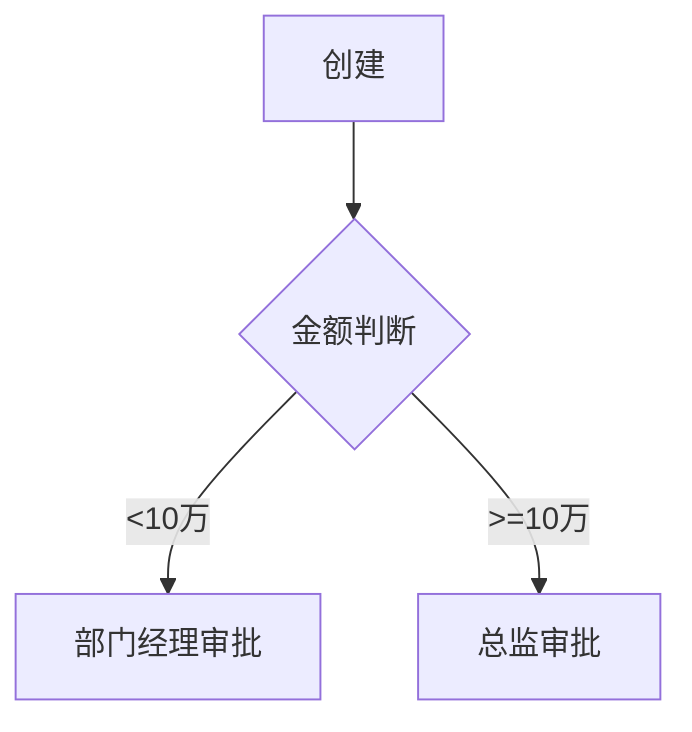

# B 端需求调研 Prompt 集

**使用场景**: 需求调研前准备问题、调研后整理报告

---

## 第一部分：调研前 - 生成调研问题清单

### Prompt 模板

请为以下需求主题生成调研问题清单，涵盖 6 个维度：

**调研主题**: [填写主题，如"采购流程优化"]
**调研对象**: [填写角色，如"采购部门主管、采购员"]

---

### 生成内容要求

#### 1. 业务背景维度（Why）

- 当前业务模式是什么？
- 涉及哪些部门和角色？
- 关键业务指标是什么？
- 为什么要做这个需求？

#### 2. 现状痛点维度（Problem）

- 当前流程是怎样的？（让用户描述完整流程）
- 哪些环节效率低？
- 哪些环节容易出错？
- 数据统计/报表是否满足需求？
- 系统操作是否便捷？

#### 3. 期望目标维度（Goal）

- 希望达到什么效果？（可量化）
- 哪些痛点优先解决？
- 能接受的时间成本？
- 有参考的竞品或系统吗？

#### 4. 业务场景维度（Scenario）

- 典型业务场景有哪些？（让用户举例）
- 异常场景有哪些？（如供应商延期交货）
- 高频场景 vs 低频场景？
- 特殊场景（如月末结算、年度盘点）？

#### 5. 数据与规则维度（Data & Rule）

- 需要录入哪些信息？
- 哪些数据需要从其他系统获取？
- 有哪些业务规则？（如审批金额阈值）
- 有哪些计算逻辑？（如税费计算）

#### 6. 权限与协同维度（Permission & Collaboration）

- 哪些角色参与这个流程？
- 各角色的职责是什么？
- 需要审批吗？审批规则？
- 需要通知哪些人？

---

### 输出格式示例

```markdown
# [需求主题]调研问题清单

## 调研信息

- 调研对象：XX 部门 - 角色 A/角色 B
- 调研时间：YYYY-MM-DD
- 调研目标：了解 XX 流程现状和优化需求

---

## 业务背景（5 个问题）

1. 当前 XX 业务的整体流程是怎样的？
2. 这个业务涉及哪些部门协作？
3. 目前的业务量级是多少？（如每天处理多少单）
4. 当前使用什么系统支持这个业务？
5. 为什么现在要优化这个流程？

## 现状痛点（8 个问题）

1. 能否完整描述一遍当前的操作流程？
2. 哪个环节最耗时？大概多久？
3. 哪个环节最容易出错？错误率大概多少？
4. 数据统计是手工还是系统？多久出一次？
5. 有没有重复录入的情况？
6. 系统响应速度如何？
7. 移动端能操作吗？
8. 历史数据能查到多久以前的？

## 期望目标（5 个问题）

1. 最希望解决的 3 个问题是什么？
2. 期望效率提升多少？（如从 30 分钟降到 5 分钟）
3. 能接受多长时间上线？
4. 有参考的竞品或其他公司做法吗？
5. 预算和资源约束？

## 业务场景（10 个问题）

1. 能举例说明一个最典型的业务场景吗？
2. 异常场景有哪些？（如 XX 延期、XX 缺货）
3. 月初/月末/年末有特殊处理吗？
4. 促销活动期间流程有变化吗？
5. 新品上架和停售如何处理？
6. 退换货场景如何处理？
7. 批量操作场景有哪些？
8. 需要导入导出数据吗？
9. 需要打印单据吗？什么格式？
10. 高峰期和平时差异大吗？

## 数据与规则（8 个问题）

1. 需要录入哪些必填信息？
2. 哪些数据可以自动带出？从哪里来？
3. 有默认值吗？
4. 有业务规则限制吗？（如金额必须>0）
5. 有审批阈值吗？（如>10 万需要总监审批）
6. 价格/税费/折扣如何计算？
7. 库存如何扣减？什么时机扣？
8. 历史数据需要迁移吗？

## 权限与协同（5 个问题）

1. 这个流程涉及哪些角色？
2. 各角色能做什么操作？
3. 需要审批吗？几级审批？
4. 审批规则是什么？（如按金额、按品类）
5. 需要通知谁？什么时候通知？
```

---

## 第二部分：调研后 - 整理调研报告

### Prompt 模板

请将以下调研记录整理为结构化需求调研报告：

[粘贴调研记录或访谈记录]

---

### 输出格式要求

````markdown
# [需求主题]调研报告

## 1. 调研概况

- **调研时间**: YYYY-MM-DD
- **调研对象**: XX 部门 - 角色 A（主要）、角色 B（次要）
- **调研方式**: 访谈/问卷/现场观察
- **调研目标**: 一句话说明

---

## 2. 业务背景

### 2.1 业务模式

简述当前业务是如何运作的

### 2.2 涉及角色

| 角色 | 职责 | 痛点 |
| ---- | ---- | ---- |

### 2.3 业务指标

- 日均业务量：
- 高峰期业务量：
- 关键指标：

---

## 3. 现状分析

### 3.1 当前流程（Mermaid 流程图）


````

### 3.2 核心痛点（按优先级）

| 痛点   | 影响             | 频率        | 严重度 | 优先级 |
| ------ | ---------------- | ----------- | ------ | ------ |
| 痛点 1 | 每次耗时 30 分钟 | 每天 10 次  | 高     | P0     |
| 痛点 2 | 容易出错         | 每周 2-3 次 | 中     | P1     |

### 3.3 当前系统使用情况

- 使用系统：
- 系统痛点：
- 数据孤岛：

---

## 4. 期望目标

### 4.1 业务目标（可量化）

- 效率提升：从 XX 分钟降到 XX 分钟
- 错误率降低：从 XX%降到 XX%
- 用户体验：XX

### 4.2 优先级排序

1. P0（必须）：
2. P1（重要）：
3. P2（可选）：

---

## 5. 关键场景（用户故事）

### 场景 1：[场景名称]（高频）

**故事描述**
作为[角色]，我想要[功能]，以便[价值]

**前置条件**

- 条件 1
- 条件 2

**主流程**

1. 步骤 1
2. 步骤 2

**异常分支**

- 异常 1：如何处理
- 异常 2：如何处理

**预期结果**

- 结果 1
- 结果 2

---

## 6. 数据与规则

### 6.1 核心数据对象

| 对象 | 关键字段 | 来源 |
| ---- | -------- | ---- |

### 6.2 业务规则

| 规则   | 描述          | 示例                 |
| ------ | ------------- | -------------------- |
| 规则 1 | XX 条件下触发 | 金额>10 万需总监审批 |

### 6.3 计算逻辑

- 计算 1：
- 计算 2：

---

## 7. 权限与协同

### 7.1 角色权限

| 角色 | 可查看 | 可创建 | 可编辑 | 可审批 | 可删除 |
| ---- | ------ | ------ | ------ | ------ | ------ |

### 7.2 审批流程



---

## 8. 待确认问题

- [ ] 问题 1：XX 场景下如何处理？
- [ ] 问题 2：XX 数据从哪个系统获取？
- [ ] 问题 3：XX 规则是否有例外？

---

## 9. 依赖与约束

- **技术依赖**：需要 XX 系统提供接口
- **时间约束**：需在 XX 时间前上线
- **资源约束**：预算 XX 万元
- **合规要求**：需符合 XX 标准

---

## 10. 下一步行动

- [ ] 补充调研：XX 场景需再次确认
- [ ] 数据收集：获取 XX 系统字段清单
- [ ] 方案设计：输出 PRD 初稿

```

---

## 使用示例

**调研前**：
```

@requirement-research-prompt.md

调研主题：采购订单审批流程优化
调研对象：采购部经理、采购员

请生成调研问题清单

```

**调研后**：
```

@requirement-research-prompt.md

请将以下调研记录整理为结构化报告：
[粘贴访谈记录]

```

```
